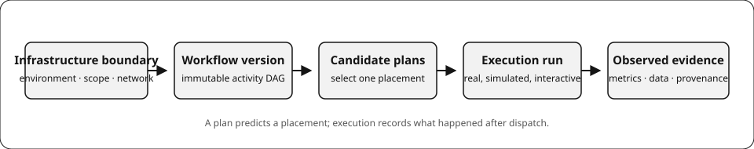

  

  # AkôFlow

  **Plan, execute, observe scientific workflows.**

  
  
  

 

  
  &nbsp;
  

 

AkôFlow is an open-source control plane for containerized scientific workflows.
Build a workflow, model or connect its environment, compare execution plans, and
retain the evidence from each run.

  

| I want to… | Go to |
| --- | --- |
| Install AkôFlow Desktop | [Download the latest release](https://github.com/UFFeScience/akoflow/releases/latest) |
| Run an end-to-end SimGrid example | [First simulated workflow](https://akoflow.com/docs/guides/workflows/first-run) |
| Use ready-to-run workflow examples | [Workflow Showcase](https://akoflow.com/docs/showcase/) |
| Configure SimGrid, Kubernetes, SLURM, storage, or cloud capacity | [Infrastructure guides](https://akoflow.com/docs/guides/infrastructure/) |
| Work with the Engine programmatically | [API reference](https://akoflow.com/docs/api/) |

## Desktop requirements

Docker Desktop on macOS and Windows, or Docker Engine with the Compose v2 plugin
on Linux. The release installer loads the corresponding runtime archives locally;
no container-registry package is required.

## Releases

A semantic tag such as `v1.2.3` creates a GitHub Release with Desktop installers,
runtime archives, and SHA-256 checksums. See [all releases](https://github.com/UFFeScience/akoflow/releases).

## Academic context

AkôFlow is developed within the e-Science Research Group, Institute of Computing,
Fluminense Federal University (UFF). The project is described in the 2024
[SBBD publication](https://doi.org/10.5753/sbbd.2024.241126).
