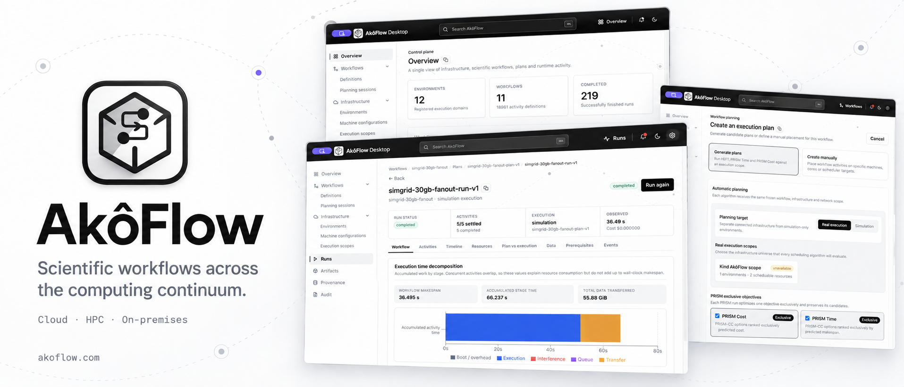

<div align="center">
  

  # AkôFlow

  **Run scientific workflows anywhere.**

  <a href="https://github.com/UFFeScience/akoflow/releases/latest"></a>
  <a href="https://akoflow.com/docs/"></a>
  <a href="https://github.com/UFFeScience/akoflow/actions/workflows/docs-checks.yaml"></a>
</div>

<br />

<div align="center">
  <a href="https://github.com/UFFeScience/akoflow/releases/latest"></a>
  &nbsp;
  <a href="https://akoflow.com/docs/getting-started"></a>
</div>

<br />

AkôFlow helps you create workflows, choose where they run, execute them, and see
the result.

| To… | Open |
| --- | --- |
| Install Desktop | [Download AkôFlow](https://github.com/UFFeScience/akoflow/releases/latest) |
| Run a SimGrid example | [First workflow](https://akoflow.com/docs/guides/workflows/first-run) |
| Explore examples | [Workflow Showcase](https://akoflow.com/docs/showcase/) |
| Use the API | [API reference](https://akoflow.com/docs/reference/api-overview) |

## Desktop requirements

Use Docker Desktop on macOS and Windows, or Docker Engine with Compose v2 on
Linux. Runtime archives are included with each release; no container registry is required.

## Academic context

<a href="https://github.com/UFFeScience"></a>

AkôFlow is developed by the [UFFeScience](https://github.com/UFFeScience)
research group at the Institute of Computing, Fluminense Federal University
(UFF). The group develops open tools and research for data-intensive science,
workflows, and distributed computing.

<br clear="left" />

<a href="https://github.com/UFFeScience/akoflow/graphs/contributors"></a>
&nbsp;
<a href="https://github.com/UFFeScience/akoflow/graphs/contributors">Meet the contributors →</a>

<br /><br />

<a href="https://github.com/UFFeScience/akoflow/graphs/contributors"></a>

## Cite AkôFlow

If AkôFlow contributes to your research, please cite:

```bibtex
@inproceedings{ferreira2024akoflow,
  author    = {Ferreira, Wesley and Kunstmann, Liliane and Paes, Aline and Bedo, Marcos and de Oliveira, Daniel},
  title     = {AkôFlow: um Middleware para execução de Workflows científicos em múltiplos ambientes conteinerizados},
  booktitle = {Proceedings of the 39th Brazilian Symposium on Databases (SBBD)},
  pages     = {27--39},
  year      = {2024},
  doi       = {10.5753/sbbd.2024.241126}
}
```

[Read the publication](https://doi.org/10.5753/sbbd.2024.241126).
