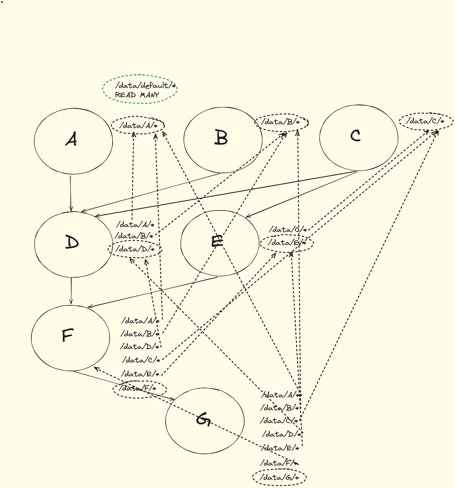

Aqui estão alguns exemplos de atividades de workflow, que podem ser usadas para construir workflows mais complexos.

## Atividade Simples

## Atividade com Dependência

## Atividade com Recursos

## Atividade com NodeSelector

Aqui está um exemplo de atividade com um seletor de nó, que especifica em qual nó do Kubernetes a atividade deve ser executada.

### Fluxo de Trabalho




### Arquivo de Workflow

```yaml
name: wf-hello-world-gcp
spec:
  image: "alpine:3.7"
  namespace: "scik8sflow"
  storageClassName: "hostpath"
  storageSize: "32Mi"
  storageAccessModes: "ReadWriteOnce"
  mountPath: "/data"
  activities:
    - name: "a"
      memoryLimit: 500Mi
      cpuLimit: 0.5
      nodeSelector: "kubernetes.io/hostname=docker-desktop"
      run: |
        echo "Hello World" >> /data/a/output.txt
        sleep 5
        echo "Hello World Again" >> /data/a/output.txt
        sleep 5
        echo "Hello World One More Time" >> /data/a/output.txt

    - name: "b"
      memoryLimit: 500Mi
      cpuLimit: 0.5
      nodeSelector: "kubernetes.io/hostname=docker-desktop"
      run: |
        echo "Good Afternoon" >> /data/b/output.txt
        sleep 5
        echo "Good Afternoon Again" >> /data/b/output.txt
        sleep 5
        echo "Good Afternoon One More Time" >> /data/b/output.txt

    - name: "c"
      memoryLimit: 500Mi
      cpuLimit: 0.5
      nodeSelector: "kubernetes.io/hostname=docker-desktop"
      run: |
        echo "Goodbye" >> /data/c/output.txt
        sleep 5
        echo "Goodbye Again" >> /data/c/output.txt
        sleep 5
        echo "Goodbye One More Time" >> /data/c/output.txt

    - name: "d"
      memoryLimit: 500Mi
      cpuLimit: 0.5
      nodeSelector: "kubernetes.io/hostname=docker-desktop"
      run: |
        echo "Goodbye" >> /data/d/output.txt
        sleep 5
        echo "Goodbye Again" >> /data/d/output.txt
        sleep 5
        echo "Goodbye One More Time" >> /data/d/output.txt
      dependsOn:
        - "a"
        - "b"
        - "c"

    - name: "e"
      memoryLimit: 500Mi
      cpuLimit: 0.5
      nodeSelector: "kubernetes.io/hostname=docker-desktop"
      run: |
        echo "Goodbye" >> /data/e/output.txt
        sleep 5
        echo "Goodbye Again" >> /data/e/output.txt
        sleep 5
        echo "Goodbye One More Time" >> /data/e/output.txt
      dependsOn:
        - "c"
    - name: "f"
      memoryLimit: 500Mi
      cpuLimit: 0.5
      nodeSelector: "kubernetes.io/hostname=docker-desktop"
      run: |
        echo "Goodbye" >> /data/f/output.txt
        sleep 5
        echo "Goodbye Again" >> /data/f/output.txt
        sleep 5
        echo "Goodbye One More Time" >> /data/f/output.txt
      dependsOn:
        - "d"
        - "e"

    - name: "g"
      memoryLimit: 500Mi
      cpuLimit: 0.5
      nodeSelector: "kubernetes.io/hostname=docker-desktop"
      run: |
        echo "Goodbye" >> /data/g/output.txt
        sleep 5
        echo "Goodbye Again" >> /data/g/output.txt
        sleep 5
        echo "Goodbye One More Time" >> /data/g/output.txt
        sleep 300

      dependsOn:
        - "f"

```
