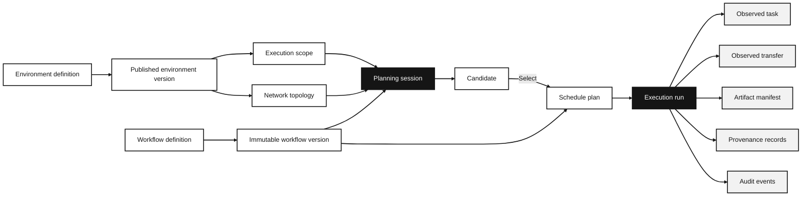

AkôFlow keeps the workflow you define, the environment available to it, the plan you choose, and the observed run as separate records. You can compare plans for the same workflow without changing its definition.

For exact YAML fields, use the [workflow specification](/docs/internal/workflow-spec) and [environment reference](/docs/reference/environment-yaml). For an example you can run, use the [SimGrid API tutorial](/docs/guides/workflows/first-run). Developers can continue to [Architecture internals](/docs/modules).

## The record chain

The arrows express references, not a single mutable object. A planning session preserves a snapshot of the workflow, scope, inventory, topology, profiles, constraints, and selected algorithms. A later discovery refresh can create new inventory for future sessions, but it does not change that earlier comparison.

## Infrastructure is a versioned boundary

An **environment** names an infrastructure boundary: a local host, Kubernetes cluster, SSH/SLURM system, modeled SimGrid platform, or cloud configuration. Its published version can contain runtimes, resources and their hierarchy, runtime bindings, storage, connection observations, and capability observations.

A **resource** is capacity that may be assigned by a plan. A **runtime** says how an activity is launched and observed. A binding states which runtime may use which resource. The [runtime adapters explanation](/docs/runtimes) describes that boundary in more detail.

An **execution scope** chooses the published environment versions that an algorithm may consider. Its network topology supplies directed links between resources. This means a plan answers a constrained question—"place this workflow on this frozen universe"—rather than a claim about every resource the daemon may ever discover.

## A workflow describes intent, not placement

A workflow definition owns identity and namespace. Its immutable version has activities plus control and data dependencies. Activities carry executable and resource requirements and may carry a simulation profile. They do not name a target resource; that is a planning decision.

Control dependencies establish ordering. Data dependencies identify the producer, consumer, logical data, and byte volume used for movement modeling. In the current portable importer, a data dependency contributes to scheduling only when its producer/consumer pair also has the matching control dependency. This protects the DAG semantics from a data declaration that has no ordering edge.

## A plan is a prediction and a decision

A planning session may produce several **candidates**. They are alternatives, not runnable plans in their own right. Selecting a candidate promotes its placement to a canonical **schedule plan** with assignments and predicted ready, start, finish, runtime, transfer, and cost values. Manual and imported plans use the same plan aggregate after validation.

Planning does not start work. The [planning explanation](/docs/explanations/planning) explains why candidates, objectives, and a selected plan are different records.

## Execution creates observations

An **execution run** binds one selected plan to real, simulation, or interactive mode. The supervisor persists task attempts, runtime handles, transfer routes, logs, artifact manifests, and timing. Those records are observations of a run; they do not retroactively alter the plan prediction.

An executable artifact is immutable runnable input. An artifact manifest is an observed output from an activity. They are deliberately different: an input can be materialized before a task starts, while an output can become a scientific data object only after the activity has been observed.

Read [execution and control-plane behavior](/docs/engine) for orchestration, [network modeling](/docs/explanations/network-modeling) for movement assumptions, and [evidence and provenance](/docs/explanations/evidence-and-provenance) for the records used to compare a plan with a completed run.
