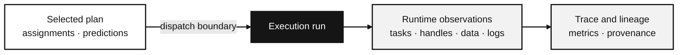

---

id: evidence-and-provenance
title: Compare a plan with a completed run
sidebar_label: Evidence and provenance
description: How AkôFlow preserves predictions, runtime observations, artifacts, lineage, and audit history.
---

AkôFlow keeps a plan's predictions alongside what happened during the run. Compare them to see whether activities took longer than expected, used different resources, or moved data differently.

Use [Trace a result with provenance](/docs/guides/data/provenance) for the scientific records. [Inspect audit events](/docs/guides/data/audit-events) only when a connection check, resource discovery, or console action is relevant. This explanation shows how those records differ.

## Two timelines for one selected plan

The plan retains predicted duration and cost. A task attempt can record its planned and actual resource, runtime, queue time, transfers, and startup time, depending on what the runtime reports. The execution trace combines these observations into run metrics. A completed run does not mean the prediction was accurate.

## What the run records

In real execution, a runtime handle identifies a started process, container, Kubernetes Job, or Slurm job for later status checks. A simulated run records modeled task timing without a provider job to inspect.

Transfer records can show how data reached a task and how many bytes moved. Where the runtime supports it, artifact records show files created or changed by the task. If required output observation fails, a task's zero exit code alone does not establish a valid result.

## Lineage and audit answer different questions

**Provenance** connects scientific entities, produced data, their locations, and the workflow activity that created them. It answers questions such as "which run produced this file?" or "which input lineage fed this result?"

**Audit** currently records connection health checks, resource discovery, and console commands or sessions. It helps answer when those actions ran and whether they succeeded. Console events can include an actor ID; connection and discovery events do not identify who initiated them. Credential changes and workflow operations are not recorded here. Their current records and operation details may show status, but a complete change history is not available through Audit.

## Compare before drawing conclusions

Compare a selected plan with a completed run at the same scope and execution mode. Check assignments, transfer records, activity attempts, and provider conditions before attributing a makespan gap to the scheduling algorithm. The execution trace reports both wall-clock makespan and accumulated activity-stage totals; [interpreting observed timing](/docs/explanations/observed-timing) defines the distinction.

## Related material

- [Execution control plane](/docs/engine)
- [Planning and plans](/docs/explanations/planning)
- [Network modeling](/docs/explanations/network-modeling)
- [Planning and execution state reference](/docs/reference/planning-and-execution-states)
