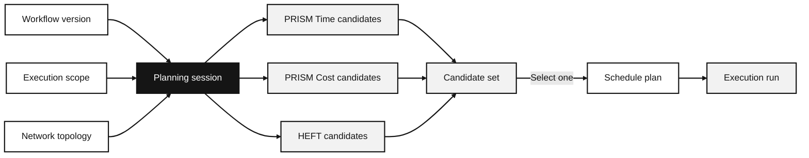

---

title: Planning, candidates, and selected plans
sidebar_label: Planning and plans
description: Why planning sessions produce candidates before one placement becomes a saved plan.
---

A plan records where a workflow's activities should run within an execution scope. You can make one manually or use a planning session to compare predicted placements and costs. Selecting a plan does not start a run or reserve infrastructure.

Use [Plan a workflow](/docs/guides/workflows/planning) for the Desktop or API procedure; this explanation covers the model behind it.

## A planning session freezes the question

A planning session records the workflow version, available resources, network topology, deadline, budget, and selected algorithms. It also keeps the profiles and environment data used for prediction. This lets you compare candidates against the same inputs, even if the environment changes later.

Every step is a recorded state. The session is not deleted when candidates are rejected; it remains a durable record of the question that was asked. The schedule plan is the only object that crosses the boundary into execution.

## Candidates are alternatives, not executions

A candidate contains a possible placement with predicted makespan, cost, and feasibility. After the session completes, it receives rank and Pareto metadata for comparison. Several candidates can come from the same algorithm and objective.

Selecting a candidate saves it as a schedule plan; it does not start a run. The plan records where activities should run and their predicted timing and cost. It can also include cloud setup actions. You can instead supply or import a placement, subject to validation.

Plan validation checks placement and workflow constraints. The runtime binding for each assignment is checked when execution starts, so a saved plan can still fail to start if its assigned resource has no compatible enabled runtime.

## Objectives and constraints answer different questions

An algorithm's objective ranks candidates. Deadline and budget determine whether each candidate meets your constraints. A candidate may remain visible even when it misses a limit, so you can inspect the alternatives the planner found.

The built-in schedulers are HEFT, PRISM Time, and PRISM Cost. They rank candidates in different ways; [PRISM and HEFT](/docs/explanations/prism-and-heft) explains those differences. A completed run supplies the evidence needed to assess the selected plan's prediction.

## Why a plan can differ from a completed run

Planning works from snapshots and models. An actual run adds provider queueing, startup behavior, data preparation, runtime availability, and observed transfer behavior. Those are recorded with the execution rather than silently rewritten into the plan. Read [plan-versus-observed evidence](/docs/explanations/evidence-and-provenance) for how to interpret the comparison.

## Related material

- [Planning and execution state reference](/docs/reference/planning-and-execution-states)
- [Execution scopes and topologies](/docs/reference/execution-scopes-and-topologies)
- [Network modeling](/docs/explanations/network-modeling)
- [Execute and monitor a workflow](/docs/guides/workflows/executions)
