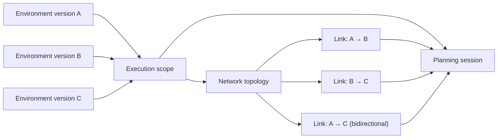

An execution scope tells the planner which environments it may use. If dependent activities may run on different resources, model the links between them so transfer estimates have a route. For a single-machine workflow, an empty topology is enough. The current Desktop creates an empty topology with a scope; use the API procedure below to register one with links.

For the API commands on this page, complete [API connection setup](/docs/tutorials/api-access) first.

## Scope, environments, and topology



The diagram highlights a deliberate constraint: a planning session reads the scope as a single frozen universe. Adding a new environment version to a scope after a session has started does not retroactively change the candidates that session evaluated. Create a new session if you want to add resources.

## Create a scope

### Using AkôFlow Desktop

1. Open **Infrastructure → Execution scopes**.
2. Select **Create scope**.
3. Enter an ID and name.
4. Select one or more published environment versions.
5. Leave **Create the initial network topology** selected if you want Desktop to create an empty topology with the scope.
6. Save, then open the scope detail to review its members.


*The catalog is a compact inventory: every row shows the scope name, its stable ID, the environment version selected for it and the number of member environments. Opening a row exposes the scope detail; it does not create a new connection or resource.*

A scope is not a copy of its environments and does not create connections or resources.

### Using the API

Create the scope first. Its optional `networkTopologyId` can name the topology created next; the topology refers back to the scope by `executionScopeId`. Planning selects the topology it will use. The IDs below illustrate the relationship: replace `hpc-v1` and `cloud-v1` with published environment-version IDs in your instance. For a complete runnable set, use the [versioned SimGrid tutorial](/docs/guides/workflows/first-run).

```bash
curl --fail-with-body \
  -H "Authorization: Bearer $AKOFLOW_API_TOKEN" \
  -H 'Content-Type: application/json' \
  -X POST "$AKOFLOW_API_URL/execution-scopes/" \
  -d '{
    "id":"hybrid-research",
    "name":"Hybrid research",
    "networkTopologyId":"hybrid-network-v1",
    "environmentVersionIds":["hpc-v1","cloud-v1"]
  }'
```

List or inspect scopes with:

```bash
curl --fail-with-body -H "Authorization: Bearer $AKOFLOW_API_TOKEN" "$AKOFLOW_API_URL/execution-scopes/"
curl --fail-with-body -H "Authorization: Bearer $AKOFLOW_API_TOKEN" "$AKOFLOW_API_URL/execution-scopes/hybrid-research/"
```

## Add a network topology

### Using AkôFlow Desktop

The scope form can create an empty initial topology. The current Desktop sidebar does not expose the separate topology-creation form, so use the API to register a topology with links. This creates a new topology; it does not edit the empty one. Select the topology with links when planning.

Each API link identifies source and target **resource IDs**, bandwidth in bits per second, latency in seconds, transfer price per byte, and whether traffic is bidirectional.

Topology values affect transfer estimates. They do not test the physical network and are not produced by a connection health check.

### Using the API

```bash
curl --fail-with-body \
  -H "Authorization: Bearer $AKOFLOW_API_TOKEN" \
  -H 'Content-Type: application/json' \
  -X POST "$AKOFLOW_API_URL/network-topologies/" \
  -d '{
    "id":"hybrid-network-v1",
    "name":"HPC to cloud",
    "version":1,
    "executionScopeId":"hybrid-research",
    "links":[{
      "id":"hpc-cloud",
      "sourceResourceId":"hpc-cluster",
      "targetResourceId":"cloud-capacity-small",
      "bandwidthBitsPerSecond":1000000000,
      "latencySeconds":0.03,
      "pricePerByte":0,
      "bidirectional":true
    }]
  }'
```

Retrieve the stored model before using it for planning:

```bash
curl --fail-with-body -H "Authorization: Bearer $AKOFLOW_API_TOKEN" \
  "$AKOFLOW_API_URL/network-topologies/hybrid-network-v1/"
```

Replace `hpc-cluster` and `cloud-capacity-small` with resource IDs from those environment versions. The API does not check that a link's resources belong to the scope or measure the real bandwidth and latency; verify those values before using the topology for planning.

## Inspect scopes and topologies in Desktop

The scope catalog shows the planning boundaries already available. The detail page makes membership explicit before a workflow is planned.


Network topologies are separate records because the same scope can be evaluated under different connectivity assumptions. Inspect the nodes and links before selecting a topology for planning.


