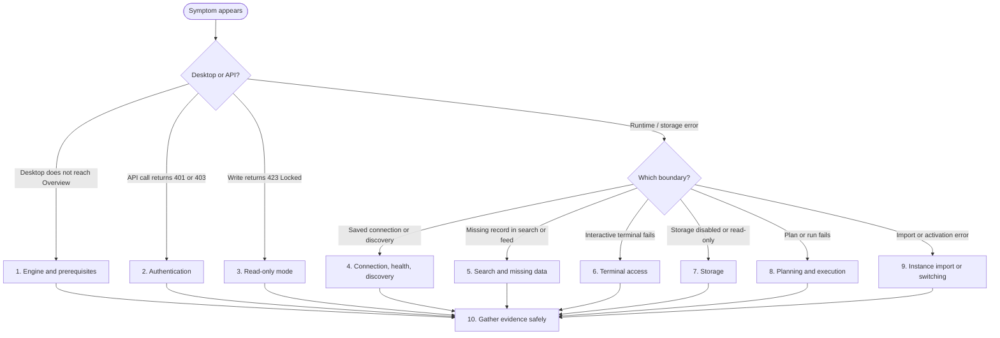

---

title: Troubleshooting
description: Diagnose daemon access, authentication, connection, discovery, planning, execution, storage, and snapshot problems.
---

import useBaseUrl from '@docusaurus/useBaseUrl';

# Troubleshooting

Start at the first failing boundary. Desktop is a client of the Engine API; the Engine then talks to Docker/BuildKit, runtimes, remote connections, storage and cloud providers.


Use the decision tree below to pick the section that matches the first failing boundary; the numbered headings later in this page correspond to the branches.



Set the endpoint and token before using the checks below:

```bash
export AKOFLOW_API_URL='http://127.0.0.1:<daemon-port>/akoflow-api'
export AKOFLOW_API_TOKEN='<daemon-token>'
```

## 1. Check the Engine and prerequisites

The root endpoint is the basic health check:

```bash
curl --fail-with-body "${AKOFLOW_API_URL%/akoflow-api}/"
```

Then run the authenticated preflight:

```bash
curl --fail-with-body \
  -H "Authorization: Bearer $AKOFLOW_API_TOKEN" \
  "$AKOFLOW_API_URL/preflight/"
```

The first-run Desktop screen performs this check before environment onboarding. It reports the AkôFlow daemon, host Docker daemon, and BuildKit readiness exposed by the current runtime.

If Desktop shows **Instance identity unavailable**, the Engine did not provide `/instance/`. Confirm that the current matching Engine container/version is running, inspect its logs, and retry. Do not create an identity manually just to hide a startup failure; the Engine creates it from the hostname.

## 2. Fix authentication

For direct API calls, `401 Unauthorized` usually means a missing or invalid bearer token. Set `AKOFLOW_API_TOKEN` to the token configured for the daemon and retry with `Authorization: Bearer <token>`.

The packaged Desktop manages its own local API connection; you do not need to paste its token into the application. In a separate web development client, **Settings → General → API access token** can supply a token for that client. A `403 Forbidden` response can also mean the request is outside a loopback-only access boundary; check the daemon listen address and caller location before changing credentials.

Avoid putting tokens in URLs, screenshots, workflow files, or committed shell history.

## 3. Recognize read-only mode

If a write returns `423 Locked` with `the selected instance is a read-only snapshot`, the system is working as designed. Open **Settings → Data management** and select **Return to writable instance**, or call:

```bash
curl --fail-with-body \
  -H "Authorization: Bearer $AKOFLOW_API_TOKEN" \
  -X POST "$AKOFLOW_API_URL/instance-activations/default/"
```

The daemon may restart. Desktop waits up to 90 seconds; a temporary connection failure is expected during that restart.

## 4. Separate connection testing, health and discovery

These operations answer different questions:

| Check | Meaning |
|---|---|
| `POST /connection-tests/` | Tests an unsaved connection payload |
| `POST /environment-connections/{id}/health/` | Checks one saved connection and records health history |
| `POST /environment-connections/{id}/discover/` | Collects infrastructure snapshots through that connection |

Test the credential and endpoint first, then health, then discovery. A healthy connection does not guarantee every expected resource will be discovered.

Typical SSH causes are an unauthorized public key, wrong user/port, missing gateway authorization, invalid proxy command, or a key assigned to a different connection. Open **Settings → SSH service keys**, verify the assigned badge and fingerprint, and authorize the displayed public key on every hop.

For historical evidence:

```bash
curl -H "Authorization: Bearer $AKOFLOW_API_TOKEN" \
  "$AKOFLOW_API_URL/environment-connections/$CONNECTION_ID/history/?limit=20"
```

## 5. Diagnose search and missing data

- Empty global search deliberately returns no entities.
- Search loads the same catalogs as list pages; a catalog error makes search fail rather than return a partial mixed result.
- Use an exact ID when possible, or constrain `types` in the API.
- If a newly created operation is absent from notifications, open its owning list/detail page. Notifications are profile-local and are not rebuilt from audit history.

## 6. Diagnose terminal access

An interactive terminal needs a resource that resolves to a usable runtime and connection. If opening fails:

1. verify the resource exists and has a runtime binding;
2. verify its connection health;
3. verify SSH key assignment and remote authorization;
4. check **Audit** for `console.*` events;
5. retry only after correcting the underlying connection.

`503 interactive console is unavailable` means the Engine was started without terminal support. `422` indicates request/resource/connection/startup failure. `404` on close or log means the session is unknown or its archived log is unavailable.

If a WebSocket works over HTTP but not through a reverse proxy, confirm that the proxy supports WebSocket upgrade and preserves the configured origin/authentication boundary.

## 7. Diagnose storage

Storage controls are disabled when the selected storage is unhealthy/offline/unauthorized or when its advertised capabilities do not allow the operation. A read-only storage can be browsed/downloaded when healthy but cannot accept upload, copy, rename, removal or other writes.

Check the environment connection before treating a storage error as a file-path problem. Browsing is restricted to roots approved by discovery/configuration; paths outside them are rejected by the Engine.

## 8. Diagnose planning and execution

For planning, confirm that the workflow version, execution scope, environment versions, resources and network topology still exist and are mutually compatible. Refresh connection health before starting work against real environments.

For execution:

1. open the run and identify the first failed or blocked activity;
2. inspect its failure reason, resolved resource/runtime and logs;
3. compare planned and observed transfer, queue and execution timing;
4. check artifact materialization and storage health;
5. correlate IDs and timestamps in **Audit** and **Provenance**.

Do not assume an HTTP `202 Accepted` means a long-running operation completed; it means the operation was queued or accepted. Follow its detail endpoint until a terminal state.

## 9. Diagnose instance import or switching

Import returns `422` for an invalid ZIP, unsupported manifest/version, missing redaction guarantee, excessive size/file count, symbolic link, checksum mismatch or invalid database schema. Use only ZIPs exported by a compatible AkôFlow instance; do not modify their contents.

If switching says the daemon did not return:

- wait for the Engine container to become healthy;
- call `/instances/` and verify which item is `active`;
- restart the daemon manually when the activation response had `"restarting":false`;
- return to `default` through the activation endpoint if the snapshot cannot open.

## 10. Gather evidence safely

Collect IDs, timestamps, status/failure fields, relevant execution logs, connection health history, audit events and provenance queries. Redact Bearer tokens, private keys, provider credential JSON, sensitive environment variables and secrets printed by commands.

Useful endpoints:

```bash
# Durable operational events
curl --get -H "Authorization: Bearer $AKOFLOW_API_TOKEN" \
  --data-urlencode 'outcome=failed' \
  --data-urlencode 'limit=100' \
  "$AKOFLOW_API_URL/audit-events/"

# Available instance modes
curl -H "Authorization: Bearer $AKOFLOW_API_TOKEN" \
  "$AKOFLOW_API_URL/instances/"

# Current Engine identity
curl -H "Authorization: Bearer $AKOFLOW_API_TOKEN" \
  "$AKOFLOW_API_URL/instance/"
```

Factory reset is a last resort, not a diagnostic step. Export a sanitized snapshot first and use reset only when loss of local control-plane state is intentional.
