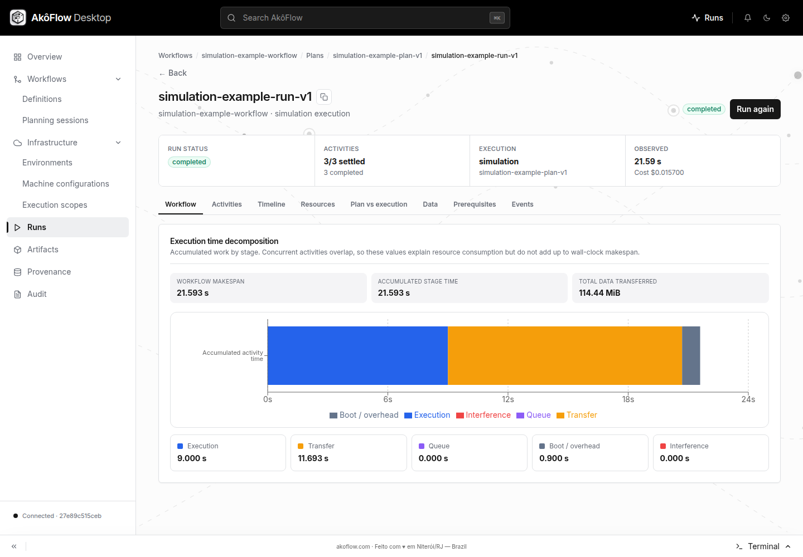

# Run the SimGrid example through the API

This tutorial is for a reader with a separately managed AkôFlow API endpoint. You will submit a three-activity workflow to SimGrid and verify that all activities and both data transfers completed. Nothing is dispatched to Kubernetes, SLURM, or a cloud account.

The example imports a fixed plan so the first result is reproducible. After it succeeds, use [Plan a workflow](./planning.md) to compare automatic scheduling choices.

## Before you begin

You need Git, Bash, `curl`, `jq`, and an AkôFlow server with the SimGrid runner available.
Complete [API connection setup](../../tutorials/api-access) first, using a server
whose URL and token you manage. The graphical Desktop setup does not expose a
token for these commands; use the [server installation](../operations/server-instance)
if you need a separately managed API endpoint.

Download the matching example source and enter its directory:

```bash
git clone --branch v1.0.8 --depth 1 https://github.com/UFFeScience/akoflow.git akoflow-first-run
cd akoflow-first-run
```

If you already have a matching checkout, enter that repository instead. Run the
commands below in the same Bash session where you configured `AKOFLOW_API_URL`
and `AKOFLOW_API_TOKEN`.

Check the server before registering anything:

```bash
curl --fail-with-body \
  -H "Authorization: Bearer $AKOFLOW_API_TOKEN" \
  "$AKOFLOW_API_URL/preflight/" | jq
```

Continue only when `server.available` is `true`. For this tutorial, the SimGrid runner must also be present in the server container or configured with `AKOFLOW_SIMGRID_BINARY`.

:::note Fresh identifiers
The files use stable IDs such as `simulation-example` and `simulation-example-run-v1`. Run them against a fresh instance. If those IDs already exist, use another instance or change the IDs consistently across all six files; repeating only part of the sequence returns `422` or a foreign-key error.
:::

## Understand what will run

The versioned bundle lives in [`examples/simulation`](https://github.com/UFFeScience/akoflow/tree/v1.0.8/examples/simulation):

| File                     | Purpose                                                                                              |
| ------------------------ | ---------------------------------------------------------------------------------------------------- |
| `environment.yaml`       | SimGrid runtime, a two-core edge resource, and an eight-core cloud resource                          |
| `scope.yaml`             | Limits planning and execution to that environment version                                            |
| `topology.yaml`          | A shared 100 Mbit/s bidirectional link with 50 ms latency                                            |
| `workflow.yaml`          | `prepare → analyze → summarize`, including individual simulation durations and two data dependencies |
| `plan-request.yaml`      | Fixed edge → cloud → edge placement and predicted timing                                             |
| `execution-request.yaml` | Frozen execution snapshot submitted to SimGrid                                                       |

The activities have base durations of 4 s, 12 s, and 2 s. The cloud resource has a `computeSpeedup` of 4, so `analyze` requires about 3 s of computation there. Moving 100,000,000 bytes to the cloud and 20,000,000 bytes back makes network time observable.

## 1. Register the environment

Submit the environment first because every later object refers to its version and resources:

```bash
curl --fail-with-body \
  -H "Authorization: Bearer $AKOFLOW_API_TOKEN" \
  -H 'Content-Type: application/yaml' \
  --data-binary @examples/simulation/environment.yaml \
  "$AKOFLOW_API_URL/environments/"
```

Verify that both resources and the simulation runtime were stored:

```bash
curl --fail-with-body \
  -H "Authorization: Bearer $AKOFLOW_API_TOKEN" \
  "$AKOFLOW_API_URL/environments/simulation-example/" |
  jq '{environment: .environment.id,
       runtime: .runtimes[0].driver,
       resources: [.resources[].id]}'
```

Expected identifiers are `simulation-example`, `simgrid`, `simulated-edge`, and `simulated-cloud`.

## 2. Register the scope and network

The topology must reference an existing scope, so submit them in this order:

```bash
curl --fail-with-body \
  -H "Authorization: Bearer $AKOFLOW_API_TOKEN" \
  -H 'Content-Type: application/yaml' \
  --data-binary @examples/simulation/scope.yaml \
  "$AKOFLOW_API_URL/execution-scopes/"

curl --fail-with-body \
  -H "Authorization: Bearer $AKOFLOW_API_TOKEN" \
  -H 'Content-Type: application/yaml' \
  --data-binary @examples/simulation/topology.yaml \
  "$AKOFLOW_API_URL/network-topologies/"
```

At this point AkôFlow knows which resources are eligible and how data moves between them. Link bandwidth is expressed in **bits per second**; dependency sizes are expressed in **bytes**.

## 3. Register the workflow

```bash
curl --fail-with-body \
  -H "Authorization: Bearer $AKOFLOW_API_TOKEN" \
  -H 'Content-Type: application/yaml' \
  --data-binary @examples/simulation/workflow.yaml \
  "$AKOFLOW_API_URL/workflow-definitions/"
```

Verify the information that controls simulation fidelity:

```bash
curl --fail-with-body \
  -H "Authorization: Bearer $AKOFLOW_API_TOKEN" \
  "$AKOFLOW_API_URL/workflow-definitions/simulation-example-workflow/" |
  jq '{activities: [.version.activities[] |
        {name, capability: .capabilities[0],
         durationSeconds: .simulation.durationSeconds}],
       dataDependencies: (.version.dataDependencies | length)}'
```

You should see three activities with the `simulation` capability, durations 4, 12, and 2 seconds, and two data dependencies. Stop here if `simulation` or a duration is missing: a planner would otherwise estimate a different workload.

## 4. Register the fixed plan

```bash
curl --fail-with-body \
  -H "Authorization: Bearer $AKOFLOW_API_TOKEN" \
  -H 'Content-Type: application/yaml' \
  --data-binary @examples/simulation/plan-request.yaml \
  "$AKOFLOW_API_URL/schedule-plans/"
```

The plan assigns `prepare` and `summarize` to the edge and `analyze` to the cloud. The API validates the assignments against the registered workflow, scope, topology, and resources, then saves the supplied predicted time, cost, and feasibility. It does not recalculate those predictions on this route. Compare them with the observations in the completed run.

## 5. Start the simulation

```bash
curl --fail-with-body \
  -H "Authorization: Bearer $AKOFLOW_API_TOKEN" \
  -H 'Content-Type: application/yaml' \
  --data-binary @examples/simulation/execution-request.yaml \
  "$AKOFLOW_API_URL/execution-runs/"
```

Creation is asynchronous. The POST response acknowledges the command; it is not the completed run projection. Poll the requested run ID:

```bash
for attempt in {1..60}; do
  projection=$(curl --fail-with-body --silent --show-error \
    -H "Authorization: Bearer $AKOFLOW_API_TOKEN" \
    "$AKOFLOW_API_URL/execution-runs/simulation-example-run-v1/") || exit 1
  run_state=$(printf '%s' "$projection" | jq -r '.run.status')
  printf '%s\n' "$projection" | jq \
    '{status: .run.status,
      completed: .run.completedActivityCount,
      activities: .run.activityCount}'
  case "$run_state" in completed|failed|cancelled) break ;; esac
  sleep 1
done
```

The loop checks for up to 60 attempts. If it exits while the run is still pending
or running, inspect the run events before retrying the read; do not resubmit the
creation request. Continue only when the final status is `completed`. A local simulation normally finishes quickly, but the HTTP operation still follows the same asynchronous lifecycle as a real run.

## 6. Verify the result

Retrieve the durable projection and check the outcome:

```bash
curl --fail-with-body \
  -H "Authorization: Bearer $AKOFLOW_API_TOKEN" \
  "$AKOFLOW_API_URL/execution-runs/simulation-example-run-v1/" |
  jq '{status: .run.status,
       completedActivities: .run.completedActivityCount,
       activityCount: .run.activityCount,
       dataTransfers: (.dataTransfers | length),
       transferredBytes: .run.transferredBytes,
       makespanSeconds: .run.makespanSeconds,
       breakdown: .run.breakdown}'
```

A successful run has these invariant results:

- `status` is `completed`;
- all 3 of 3 activities completed;
- 2 data-transfer records exist;
- `transferredBytes` is `120000000`;
- `breakdown.computeSeconds` and `breakdown.transferSeconds` are both greater than zero.

On the development stack verified on 2026-09-11, the deterministic run reported a makespan of approximately 21.593 s, 9 s accumulated compute time, and 11.693 s accumulated transfer time. Small model or SimGrid-version changes may alter the decimal values; use the invariants above as the pass criteria.

The same six requests were also exercised against the official v1.0.8 packaged
runtime on 2026-09-12: all three activities completed, with two transfers,
120,000,000 bytes, 9 s compute and approximately 11.693 s transfer time.



_The simulation was submitted through the API and then inspected in Desktop._

The reproducibility bundle is stored under `storage/simgrid/<run-id>-<instance>/` with `platform.xml`, `simulation.json`, `result.json`, and `runner.log`.

## Run the same bundle with one command

After reviewing the individual requests, a fresh instance can run the same sequence with:

```bash
AKOFLOW_API_URL="$AKOFLOW_API_URL" \
AKOFLOW_API_TOKEN="$AKOFLOW_API_TOKEN" \
sh examples/simulation/run.sh
```

The script stops at the first HTTP failure. It does not erase or overwrite existing catalog objects.

## Find the records in Desktop

After the API sequence completes, Desktop can show its environment, workflow, plan, run, and results on the same server. These steps inspect those records; Desktop-only submission of the full bundle has not been verified.

1. Under **Infrastructure → Environments**, open `simulation-example` and confirm two resources plus the SimGrid runtime.
2. Under **Infrastructure → Execution scopes**, find the scope and its network topology.
3. Under **Workflows → Definitions**, open `simulation-example-workflow` and confirm the three-node DAG.
4. Open its plan and the completed run. Inspect **Activities**, **Timeline**, **Data**, and **Plan vs execution**.

The run is complete only when the header says `completed` and the activity summary says `3/3 settled`. In **Data**, confirm the 100 MB edge-to-cloud dependency and the 20 MB return dependency.

## Recover from common failures

| Failure                                                 | Cause and recovery                                                                                                                                               |
| ------------------------------------------------------- | ---------------------------------------------------------------------------------------------------------------------------------------------------------------- |
| `401 Unauthorized`                                      | The server requires a token. Set `AKOFLOW_API_TOKEN` and keep the `Authorization` header.                                                                        |
| `422` while creating an object                          | The stable ID probably already exists, or an earlier dependency was not created. Use a fresh instance or update every related ID consistently.                   |
| `FOREIGN KEY constraint failed` while creating the plan | An assignment activity ID does not match the registered workflow version. Use the complete files from the same repository revision.                              |
| `akoflow-simgrid-runner: executable file not found`     | Install/build the runner and set `AKOFLOW_SIMGRID_BINARY`, or use the server image that includes it.                                                             |
| Completed run has zero transferred bytes                | The workflow lacks data dependencies or producer and consumer were placed on the same resource. Recheck `workflow.yaml`, the plan assignments, and topology IDs. |
| Run remains `pending`                                   | Inspect the run events and server log; the asynchronous command may have failed before the simulation process started.                                           |

Next, use [the edge-to-cloud Showcase](../../showcase/edge-cloud-simulation) to inspect the same model visually, or [Plan a workflow](./planning.md) to compare PRISM Cost, PRISM Time, and HEFT.
