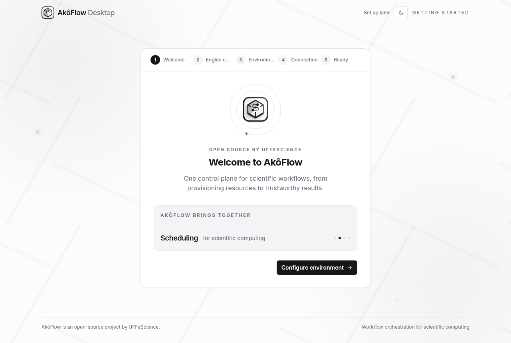
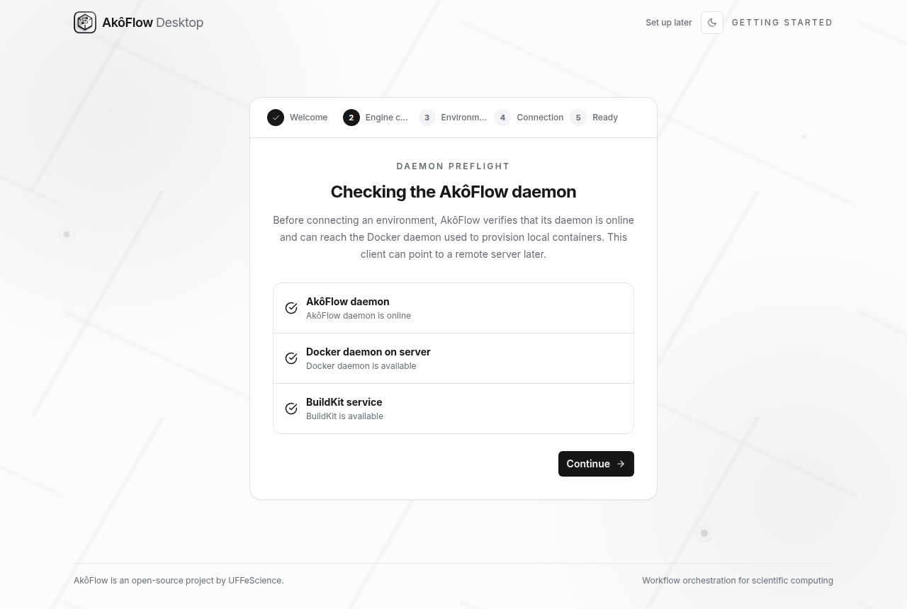
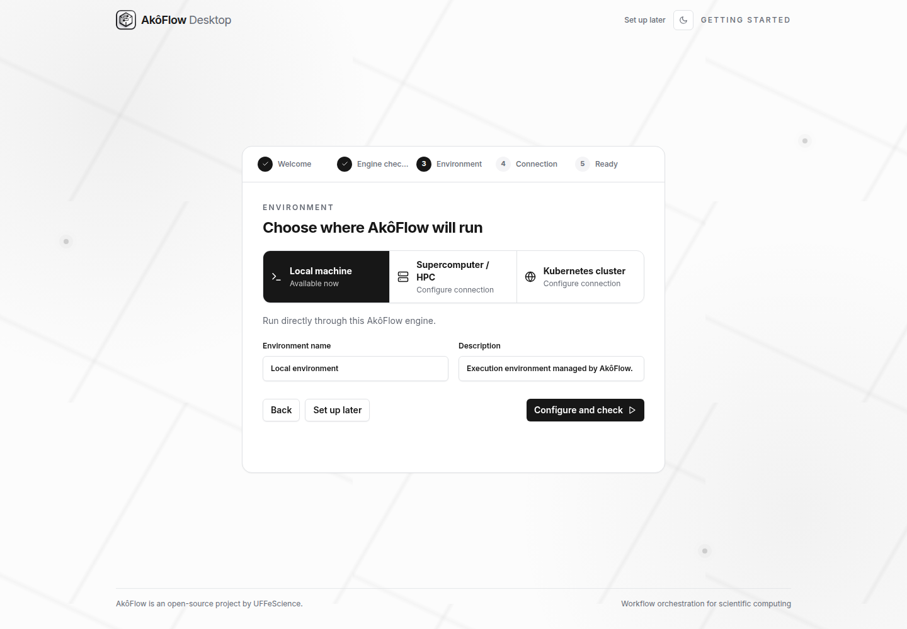
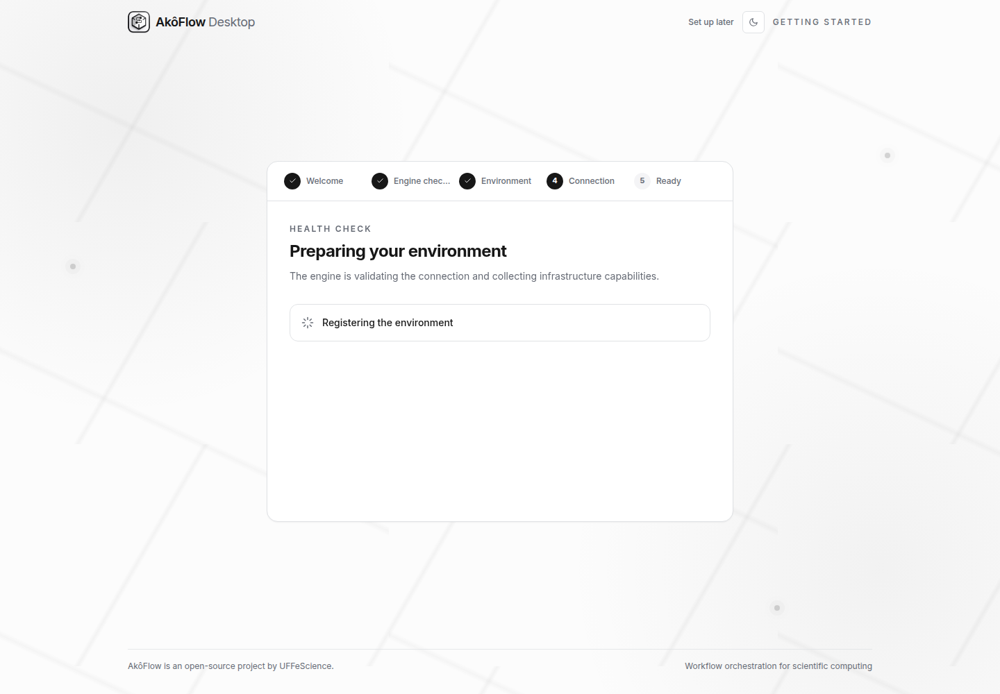
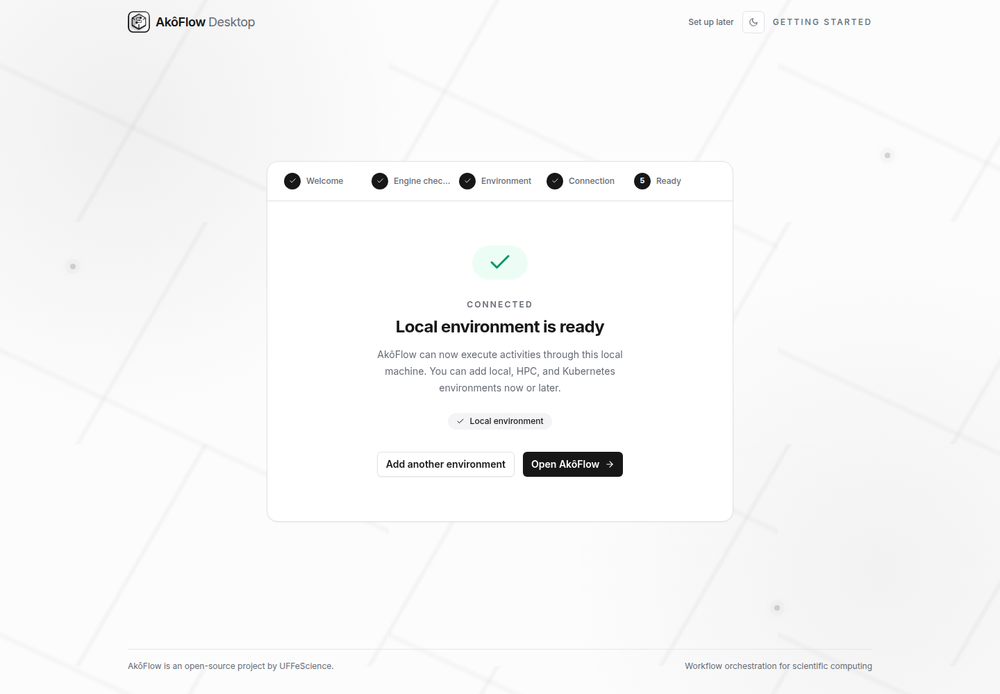
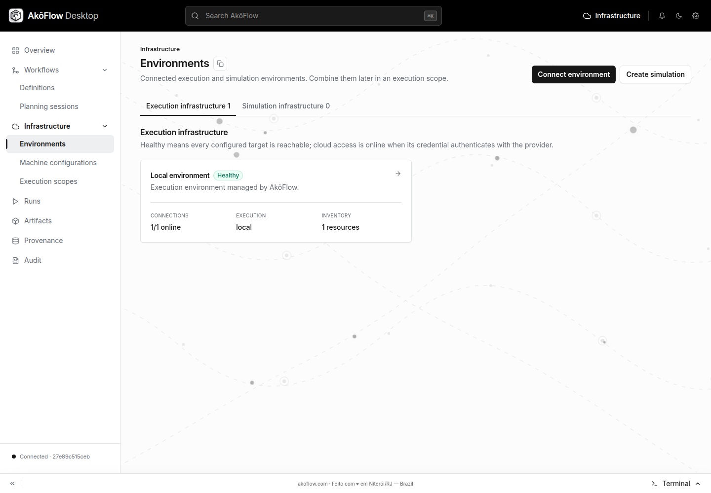
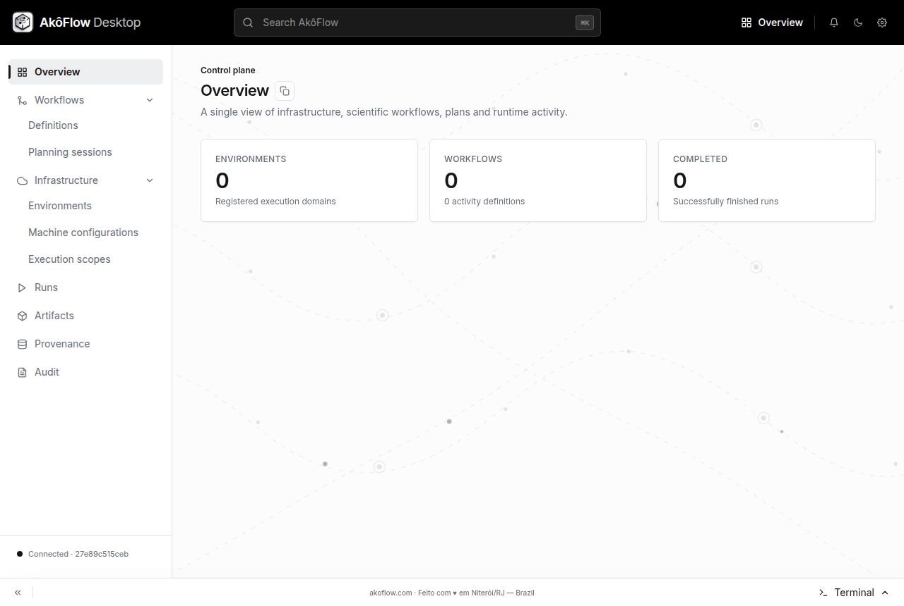

import Tabs from '@theme/Tabs';
import TabItem from '@theme/TabItem';

Install **AkôFlow Desktop** on your workstation. It uses Docker for its local
services and downloads the files it needs. You do not need a source checkout.

## Before you begin: prepare Docker

Install Docker before opening AkôFlow. Follow the official instructions for
[macOS](https://docs.docker.com/desktop/setup/install/mac-install/),
[Windows](https://docs.docker.com/desktop/setup/install/windows-install/),
[Ubuntu](https://docs.docker.com/engine/install/ubuntu/), or
[Debian](https://docs.docker.com/engine/install/debian/).
On Linux, include the Compose plugin. On Windows, complete Docker's WSL 2 or
Hyper-V prerequisites and use Linux containers. Start Docker and wait for it
to finish initializing.

Open Terminal on macOS/Linux, or PowerShell on Windows, and run:

```bash
docker info
docker compose version
```

Both commands must succeed **as the user who opens AkôFlow**.
On Linux, if access works only with `sudo`, follow Docker's
[non-root access instructions](https://docs.docker.com/engine/install/linux-postinstall/#manage-docker-as-a-non-root-user),
then sign out of the desktop session and sign back in before checking again.
Membership in the Docker group grants root-level privileges; use your site's
approved setup. A new terminal alone does not refresh the launcher session.

Keep internet access available for the first launch. Git, Go, Node.js, and
remote infrastructure accounts are not needed for local installation.

## 1. Download the correct file

Open [Downloads and releases](./downloads), choose your operating system, and
save the linked file. Wait until the browser finishes downloading before opening
it. The version in the filename must match the release tag.

| Your computer                 | Package          | Before opening AkôFlow                                                 |
| ----------------------------- | ---------------- | ---------------------------------------------------------------------- |
| macOS, Intel or Apple silicon | Universal `.dmg` | Start Docker Desktop                                                   |
| Windows x64                   | `.exe`           | Start Docker Desktop in Linux-container mode                           |
| Linux x64, Debian/Ubuntu      | `.deb`           | Install Docker Engine and Compose v2; allow your user to access Docker |
| Other Linux x64 desktops      | `.AppImage`      | Same Docker prerequisites; allow the file to execute                   |

The runtime has Linux ARM64 archives, but v1.0.8 does not include a Linux ARM64
Desktop package. Use the [server installation](./guides/operations/server-instance)
for a supported ARM64 server deployment.

The Linux v1.0.8 package was opened from an extracted copy and completed a local
workflow. A clean `apt` install and first launch on macOS, Windows, or AppImage
remain unverified.

If the download is interrupted, retry before opening the file. For a checksum,
use the [download verification procedure](./downloads#download-through-the-github-api).

## 2. Install and open

<Tabs groupId="installation-platform">
<TabItem value="mac" label="macOS">

1. Open the downloaded `.dmg`.
2. Drag **AkôFlow Desktop** into **Applications**.
3. Start Docker Desktop and wait until its engine is running.
4. Open **AkôFlow Desktop** from Applications.

If macOS blocks the application, first confirm the download came from the
[official release](https://github.com/UFFeScience/akoflow/releases/tag/v1.0.8).
See the release notes for signing limitations and your institution's policy
before allowing it to run.

</TabItem>
<TabItem value="windows" label="Windows">

1. Open `Akoflow-Desktop-1.0.8-win-x64.exe` from the browser's download list.
2. Follow the package's installation prompts, if shown, then open AkôFlow Desktop.
3. Keep Docker Desktop running with Linux containers enabled.

</TabItem>
<TabItem value="linux" label="Linux">

For Debian/Ubuntu, open a terminal in the directory containing the download:

```bash
sudo apt install ./Akoflow-Desktop-1.0.8-linux-amd64.deb
```

Open **AkôFlow Desktop** from the application launcher. For the AppImage:

```bash
chmod +x Akoflow-Desktop-1.0.8-linux-x86_64.AppImage
./Akoflow-Desktop-1.0.8-linux-x86_64.AppImage
```

</TabItem>
</Tabs>

**Expected result:** AkôFlow opens and displays **Preparing AkôFlow**, followed
by the welcome screen. The initial preparation may take several minutes.
If **AkôFlow could not start** appears, read the error and use
[installation recovery](#recover-at-the-step-that-failed) below.

## 3. First launch: what happens

Desktop checks Docker and Compose, downloads and verifies its matching service
files, then starts them locally. It handles its own API credential; you do not
need to download `.tar` files or enter a token.

### Welcome

Choose **Configure environment** for the local setup below. The assistant moves
through **Welcome → Engine checkup → Environment → Connection → Ready**.

If you only want to connect HPC or Google Cloud later, **Set up later** opens
the main interface immediately. Continue at [Installation result](#4-installation-result),
then follow the relevant remote tutorial; skipping does not register an environment.



_Welcome screen from the official v1.0.8 Linux application._

### Engine checkup

Wait for **AkôFlow daemon**, **Docker daemon on server**, and **BuildKit service**
to pass, then choose **Continue**. If any check fails, read its message, correct
the dependency and choose **Run again**. Continue stays disabled until all three
checks pass.



_The downloaded Linux package passed all three checks. Remote targets need
their own connection checks._

### Environment: configure the local execution target

Select **Local machine**. Keep **Environment name** as `Local environment`,
or use a unique name, and optionally edit **Description**. Choose
**Configure and check**.



_Local machine uses the service running in Docker. Review discovered resources
before planning work that needs your workstation's full compute capacity._

The initial assistant also offers **Supercomputer / HPC** and **Kubernetes cluster**.
For HPC, use the [guided registration tutorial](./tutorials/register-hpc) to
prepare and authorize an SSH key before connecting. For Kubernetes, use the
[cluster guide](./guides/infrastructure/kubernetes). Google Cloud is connected
from the main **Environments** catalog after leaving this assistant.

### Connection: wait for registration, health and discovery

The application registers the environment, checks its connection, and discovers
resources. Let these operations finish; success advances to **Ready** automatically.



If **Checkup needs attention** appears, read the failing operation. Use
**Edit connection** to correct the settings or **Run checkup again** to retry.
Registration can finish before a later check fails, so inspect the existing
entry rather than creating another environment with a different name.

### Ready: open the application

Wait for **Local environment is ready**, then choose **Open AkôFlow**.
**Add another environment** returns to the environment step when you want to
configure another target.



Open **Infrastructure → Environments** and confirm that **Local environment**
appears. Open it to inspect its connection and inventory.



**Expected result:** the local environment is saved, its connection check has
passed, and discovery has completed. No workflow has run yet.

## 4. Installation result

If you chose **Set up later**, open **Overview** and check that the sidebar
shows **Connected**. Then open **Infrastructure → Environments**. An empty catalog
is expected until you register an environment; the connection indicator confirms
only that Desktop reached its local daemon.



_Overview after choosing Set up later. The execution charts stay empty until a
workflow runs._

If you completed the local assistant, confirm the saved environment as described
in **Ready** above. If Desktop is not connected, use
[Troubleshooting](./guides/operations/troubleshooting) before registering a
remote target.

## 5. Continue with your execution target

- [Run your first local workflow in Desktop](./guides/workflows/first-local-run): create one activity, run it, and inspect its generated file.
- [Register an HPC / SLURM environment](./tutorials/register-hpc): authorize an SSH key, test the login connection, and discover partitions.
- [Connect Google Cloud](./tutorials/connect-cloud): validate a service account, register the environment, and synchronize the compute catalog.
- [Run the first simulated workflow](./guides/workflows/first-run): verify workflow execution through the documented API setup without a remote account.

For a server you manage separately, use the [server installation](./guides/operations/server-instance) and [API connection setup](./tutorials/api-access) guides.

## Recover at the step that failed

| Where you stopped                          | What to do                                                                                                                |
| ------------------------------------------ | ------------------------------------------------------------------------------------------------------------------------- |
| Docker command is missing                  | Complete the official Docker installation above, reopen the terminal and rerun both checks.                               |
| Docker reports permission denied on Linux  | Complete Docker access setup, sign out and back in, then reopen AkôFlow as your normal user.                              |
| Compose command is missing                 | Install the Compose plugin for your Docker installation; `docker-compose` alone is not the documented command.            |
| Preparing AkôFlow fails during download    | Read the displayed error, restore network access to GitHub release assets, then quit and reopen the application to retry. |
| AkôFlow could not start                    | Verify both Docker commands, read the startup error, correct the reported cause and reopen the app.                       |
| Engine checkup has a failed service        | Read the service message; restore Docker/BuildKit availability and choose Run again.                                      |
| Connection checkup needs attention         | Use Edit connection or Run checkup again; an environment may already have been registered.                                |
| Welcome no longer appears                  | This is expected after completing or skipping setup. Continue from Infrastructure → Environments.                         |
| The app is connected but there are no runs | Continue with a workflow tutorial; installation does not submit a workflow.                                               |

For further diagnosis, use [Troubleshooting](./guides/operations/troubleshooting).
Keep the failed step, exact error, operating system and Desktop version when
requesting help.

## Update AkôFlow

Export your instance before changing versions; see [Instance management](./guides/operations/instance-management).
Keep Desktop and its runtime on matching versions.

For the v1.0.8 download digest and verification record, see [Downloads](./downloads#download-verification-result).
