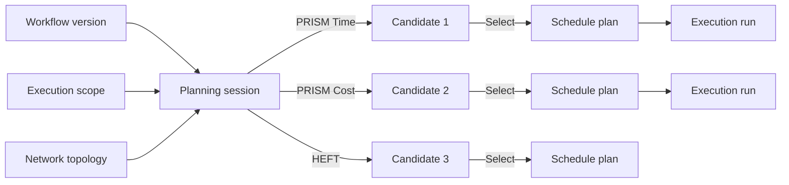

# Compare PRISM and HEFT plans

The [SimGrid first-run tutorial](../guides/workflows/first-run.md) ends with a single, fixed plan. This tutorial uses the same workflow and infrastructure but lets AkôFlow propose alternatives. You will run PRISM Time, PRISM Cost, and HEFT against the same inputs, compare their predictions, execute two candidates, and read the predicted-versus-observed evidence that AkôFlow records for each run.

The goal is to learn how AkôFlow separates *predicting* from *executing*, how the same workflow looks different under different objectives, and what the recorded evidence actually allows you to conclude.

## Before you begin

You need the same prerequisites as the [SimGrid first-run tutorial](../guides/workflows/first-run.md):

- A clone of the AkôFlow repository.
- The AkôFlow daemon running with the SimGrid runner available.
- `curl` and `jq` on your command line.
- The daemon API token, when authentication is enabled.

Set the API address and token. The development Compose stack listens on port 8080 by default:

```bash
export AKOFLOW_API_URL="http://127.0.0.1:8080/akoflow-api"
export AKOFLOW_API_TOKEN="<token>"
```

Confirm the daemon is healthy before continuing:

```bash
curl --fail-with-body \
  -H "Authorization: Bearer $AKOFLOW_API_TOKEN" \
  "$AKOFLOW_API_URL/preflight/" | jq
```

Continue only when `server.available` is `true` and the SimGrid runner is reachable.

## What you will compare

The versioned six-file bundle in [`examples/simulation`](https://github.com/UFFeScience/akoflow/tree/main/examples/simulation) defines a `prepare → analyze → summarize` DAG with two data dependencies, a two-core edge resource, an eight-core cloud resource, and a 100 Mbit/s link. The fixed plan in `plan-request.yaml` places `analyze` on the cloud. This tutorial asks AkôFlow to propose plans and runs two of them.

A session freezes one workflow version and one infrastructure scope. All algorithms in that session share the same inputs and produce distinct candidate plans. Only a selected candidate becomes an executable schedule plan.



## 1. Register the same example

If you have already run the [first-run tutorial](../guides/workflows/first-run.md), the catalog objects exist. Submit the bundle once more for a fresh start:

```bash
for endpoint in environments execution-scopes network-topologies workflow-definitions; do
  for file in examples/simulation/environment.yaml examples/simulation/scope.yaml \
             examples/simulation/topology.yaml examples/simulation/workflow.yaml; do
    if [ "$endpoint" = "workflow-definitions" ] && [ "$file" != "examples/simulation/workflow.yaml" ]; then
      continue
    fi
    if [ "$endpoint" = "execution-scopes" ] && [ "$file" != "examples/simulation/scope.yaml" ]; then
      continue
    fi
    if [ "$endpoint" = "network-topologies" ] && [ "$file" != "examples/simulation/topology.yaml" ]; then
      continue
    fi
    if [ "$endpoint" = "environments" ] && [ "$file" != "examples/simulation/environment.yaml" ]; then
      continue
    fi
    curl --fail-with-body \
      -H "Authorization: Bearer $AKOFLOW_API_TOKEN" \
      -H 'Content-Type: application/yaml' \
      --data-binary @"$file" \
      "$AKOFLOW_API_URL/$endpoint/" > /dev/null
  done
done
```

A shorter alternative is to call the bundled script, which already runs the same sequence:

```bash
AKOFLOW_API_URL="$AKOFLOW_API_URL" \
AKOFLOW_API_TOKEN="$AKOFLOW_API_TOKEN" \
sh examples/simulation/run.sh
```

Stop on the first HTTP failure. Verify the workflow before planning:

```bash
curl --fail-with-body \
  -H "Authorization: Bearer $AKOFLOW_API_TOKEN" \
  "$AKOFLOW_API_URL/workflow-definitions/simulation-example-workflow/" |
  jq '{id: .workflow.id,
       activities: [.version.activities[].name]}'
```

You should see three activities: `prepare`, `analyze`, and `summarize`. A workflow with different activity names means the rest of this tutorial will not work; restore the file or use a fresh instance.

## 2. Discover the planning algorithms

The available algorithms are reported by the server, not hard-coded in this guide:

```bash
curl -H "Authorization: Bearer $AKOFLOW_API_TOKEN" \
  "$AKOFLOW_API_URL/planning-algorithms/" | jq
```

The PRISM algorithms accept `optionCount` and `beamWidth`. The HEFT algorithm does not. A session that lists an algorithm the server does not return will be rejected. See [PRISM and HEFT](../explanations/prism-and-heft.md) for what each algorithm optimises and why they can disagree.

## 3. Open a planning session

Create one session that runs all three algorithms against the same workflow version and scope:

```bash
curl --fail-with-body \
  -H "Authorization: Bearer $AKOFLOW_API_TOKEN" \
  -H 'Content-Type: application/json' \
  -d '{
    "id": "tutorial-compare-plans",
    "workflowVersionId": "simulation-example-workflow-v1",
    "executionScopeId": "simulation-example-v1-scope",
    "networkTopologyId": "simulation-network-v1",
    "algorithms": [
      {"id": "prism-time", "configuration": {"optionCount": 25, "beamWidth": 120}},
      {"id": "prism-cost", "configuration": {"optionCount": 25, "beamWidth": 120}},
      {"id": "heft", "configuration": {}}
    ]
  }' \
  "$AKOFLOW_API_URL/planning-sessions/"
```

Creation is asynchronous; the response is `202 Accepted` and a session ID. Poll until the status is `completed`:

```bash
while :; do
  session=$(curl --fail-with-body --silent --show-error \
    -H "Authorization: Bearer $AKOFLOW_API_TOKEN" \
    "$AKOFLOW_API_URL/planning-sessions/tutorial-compare-plans/")
  state=$(printf '%s' "$session" | jq -r '.session.status')
  printf '%s\n' "$session" | jq '{status: .session.status}'
  case "$state" in completed|failed|cancelled) break ;; esac
  sleep 1
done
```

A `failed` status means the daemon could not finish planning; check the session events and the daemon log before continuing.

## 4. Compare the candidates

List the candidates the session produced:

```bash
curl -H "Authorization: Bearer $AKOFLOW_API_TOKEN" \
  "$AKOFLOW_API_URL/planning-sessions/tutorial-compare-plans/candidates/" |
  jq '.candidates
      | map({algorithm: .algorithm,
             objective: .objective,
             rank: .rank,
             makespanSeconds: .predicted.makespanSeconds,
             cost: .predicted.cost,
             feasible: .feasible})'
```

Each candidate carries:

- its **algorithm** and **objective** (one of `time`, `cost`, or HEFT's default);
- a **rank** that the server uses to order its response;
- a **feasibility** flag set by the current model;
- the **predicted makespan** and **cost**;
- a full activity-to-resource assignment list inside the schedule.

Read the detailed candidate for the algorithm you want to inspect:

```bash
curl -H "Authorization: Bearer $AKOFLOW_API_TOKEN" \
  "$AKOFLOW_API_URL/planning-sessions/tutorial-compare-plans/candidates/<candidate-id>/" |
  jq '.candidate.schedule.assignments
      | map({activity: .activityName,
             resource: .resourceId,
             predictedStart: .predictedStart,
             predictedFinish: .predictedFinish})'
```

Compare PRISM Time against HEFT. When the link bandwidth dominates the workflow, the algorithms often disagree on whether to keep `analyze` on the cloud or run it on the edge. Record the candidate IDs you want to keep; the next step selects one.

## 5. Select two candidates and execute them

Promote two candidates to canonical schedule plans. Pick one PRISM candidate and one HEFT candidate so that you can compare objective-driven placement against the comparison baseline:

```bash
# Promote the PRISM Time candidate
curl --fail-with-body -X POST \
  -H "Authorization: Bearer $AKOFLOW_API_TOKEN" \
  "$AKOFLOW_API_URL/planning-sessions/tutorial-compare-plans/candidates/<prism-candidate>/select/"

# Promote the HEFT candidate
curl --fail-with-body -X POST \
  -H "Authorization: Bearer $AKOFLOW_API_TOKEN" \
  "$AKOFLOW_API_URL/planning-sessions/tutorial-compare-plans/candidates/<heft-candidate>/select/"
```

Selection returns `201 Created` with the new plan IDs. Use a stable run ID per candidate so the comparison is reproducible:

```bash
RUN_ID_PRISM='tutorial-compare-plans-prism-v1'
RUN_ID_HEFT='tutorial-compare-plans-heft-v1'
```

Submit the same execution request shape used by `examples/simulation/execution-request.yaml`, but reference the selected plan and the chosen run ID:

```bash
curl --fail-with-body \
  -H "Authorization: Bearer $AKOFLOW_API_TOKEN" \
  -H 'Content-Type: application/yaml' \
  -d "{
    \"id\": \"$RUN_ID_PRISM\",
    \"schedulePlanId\": \"<prism-plan-id>\",
    \"mode\": \"simulation\"
  }" \
  "$AKOFLOW_API_URL/execution-runs/"

curl --fail-with-body \
  -H "Authorization: Bearer $AKOFLOW_API_TOKEN" \
  -H 'Content-Type: application/yaml' \
  -d "{
    \"id\": \"$RUN_ID_HEFT\",
    \"schedulePlanId\": \"<heft-plan-id>\",
    \"mode\": \"simulation\"
  }" \
  "$AKOFLOW_API_URL/execution-runs/"
```

Both submissions return `202 Accepted`. Poll each run until the status is `completed`:

```bash
for RUN_ID in "$RUN_ID_PRISM" "$RUN_ID_HEFT"; do
  while :; do
    run=$(curl --fail-with-body --silent --show-error \
      -H "Authorization: Bearer $AKOFLOW_API_TOKEN" \
      "$AKOFLOW_API_URL/execution-runs/$RUN_ID/")
    state=$(printf '%s' "$run" | jq -r '.run.status')
    printf '%s\n' "$run" | jq --arg id "$RUN_ID" \
      '{id: $id, status: .run.status, completed: .run.completedActivityCount}'
    case "$state" in completed|failed|cancelled) break ;; esac
    sleep 1
  done
done
```

## 6. Read the predicted-versus-observed evidence

For each completed run, compare the predicted schedule against the observed one:

```bash
for RUN_ID in "$RUN_ID_PRISM" "$RUN_ID_HEFT"; do
  curl --fail-with-body \
    -H "Authorization: Bearer $AKOFLOW_API_TOKEN" \
    "$AKOFLOW_API_URL/execution-runs/$RUN_ID/" |
    jq --arg id "$RUN_ID" '{
      id: $id,
      status: .run.status,
      completed: .run.completedActivityCount,
      transferredBytes: .run.transferredBytes,
      makespanSeconds: .run.makespanSeconds,
      predictedMakespanSeconds: .plan.predictedMakespanSeconds,
      breakdown: .run.breakdown
    }'
done
```

The Desktop draws the same comparison in the **Plan vs execution** tab. A small predicted-versus-observed gap is normal; the SimGrid model does not include scheduler wake-up latency and the kernel command path adds a few milliseconds. Compare the activity placement and the bytes transferred rather than the seconds, because the example transfers 100 MB to the cloud and 20 MB back regardless of placement.

You can also export the run evidence from the [Provenance and audit guide](../guides/data/provenance-and-audit.md). The provenance SQL endpoint lets you query both runs in one statement:

```bash
curl -H "Authorization: Bearer $AKOFLOW_API_TOKEN" \
  -H 'Content-Type: application/json' \
  -d '{
    "statement": "SELECT id, makespan_seconds, transferred_bytes FROM execution_runs WHERE id IN (?, ?) ORDER BY id",
    "params": ["'"$RUN_ID_PRISM"'", "'"$RUN_ID_HEFT"'"]
  }' \
  "$AKOFLOW_API_URL/provenance/sql/"
```

## What this evidence tells you

- The **predicted makespan** is a model answer, not a guarantee. PRISM optimises against the supplied cost or time objective; HEFT does not search the same objective space. When they disagree on placement, the predicted makespan difference reflects the model, not the workload.
- The **transferred bytes** are observed. They are the same in both runs because the same workflow is producing the same data dependencies; only the placement changes. If the bytes differ between runs, the workflow changed.
- The **breakdown** shows where SimGrid spent its time. A larger `transferSeconds` value confirms that the chosen placement actually moved data across the link.
- The **activity count** is identical. If one run has fewer activities, the workflow or plan changed, not the scheduler.

## Adapt the comparison

The same pattern answers different questions:

| Change to the example | Question you answer |
| --- | --- |
| Increase `analyze.simulation.durationSeconds` to 60 | How much does HEFT's makespan estimate grow compared with PRISM? |
| Increase `dataset.bin.sizeBytes` to 500000000 | Does PRISM Time decide to keep `analyze` on the edge instead of the cloud? |
| Add a third core to the cloud resource | Does PRISM Cost move `analyze` back to the cloud when the link dominates? |
| Set `deadlineSeconds` to 30 on the session | Which candidates are marked infeasible and what does Pareto dominance look like? |

Apply one change at a time, regenerate the candidates, and re-run. The SimGrid runtime stays deterministic for a given workflow and plan, so the bytes transferred and the activity timeline stay reproducible.

## Recover from common failures

| Failure | Cause and recovery |
| --- | --- |
| `404` selecting a candidate | The session is from a different instance or has already been promoted; check `GET /planning-sessions/`. |
| `422` on session creation | An algorithm ID is not returned by `GET /planning-algorithms/`, or the workflow version ID is wrong. |
| Run stays `pending` | Inspect run events and the daemon log; the simulation runner may be unreachable. |
| Predicted makespan is `0` | The plan was authored without predicted timing; use an automatic-planning candidate, not an imported envelope. |
| Transferred bytes differ between runs | The workflow or topology changed between submissions. Re-register the workflow and topology before retrying. |

## Next step

Read [Observed timing](../explanations/observed-timing.md) to understand how AkôFlow computes the breakdown fields, or return to the [Planning a workflow](../guides/workflows/planning.md) reference to learn how to attach a deadline, budget, or interference matrix to a session.
