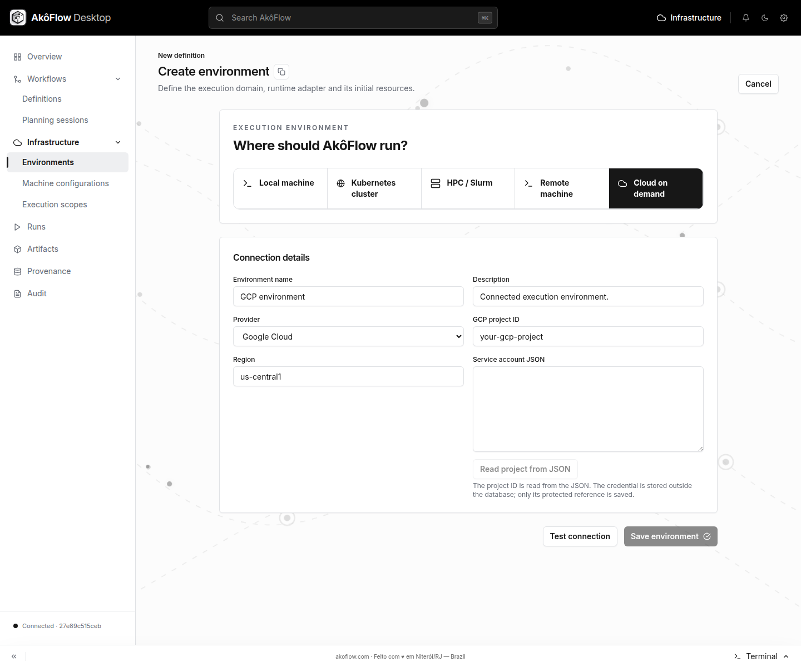

This tutorial connects **Google Cloud**, the compute provider available in the
current **Cloud on demand** form. Its result is a registered environment and a
synchronized catalog. It does not provision a VM.

AWS support is currently limited to a separately configured S3-compatible transfer connector; saved cloud credentials are not wired to it, and EC2 discovery/provisioning is unavailable. See [AWS and S3 support](../guides/infrastructure/aws).

## Before you begin

Complete [installation checks](../installation). Obtain a GCP project and an
approved service-account JSON credential from your cloud administrator. The
project needs the APIs and access described in [Configure Google Cloud](../guides/infrastructure/gcp).
Read that guide's access inventory; it distinguishes source-audited calls from
minimum IAM permissions that still require validation in a disposable project.

The service account belongs to Google Cloud. Creating an AkôFlow environment
does not create the project, service account, billing configuration or IAM grants.

## Through the interface

### 1. Open the cloud form

Go to **Infrastructure → Environments → Connect environment** and select
**Cloud on demand**. Keep **Provider** set to **Google Cloud**.



_Captured from the official v1.0.8 Linux application through Chromium DevTools,
2026-09-12. The project is a placeholder and the credential field is empty;
this image documents the form, not a successful cloud validation._

### 2. Supply the project and credential

| Field                | Enter                                        |
| -------------------- | -------------------------------------------- |
| Environment name     | A recognizable name, such as `Research GCP`  |
| GCP project ID       | Your actual project ID, not its display name |
| Region               | An allowed region, such as `us-central1`     |
| Service account JSON | The complete approved JSON credential        |

Use **Read project from JSON** to populate the project ID and check it against
the intended project. Use **Hide credential** when available before sharing your
screen. Never include the JSON credential in a workflow or a documentation capture.

### 3. Test and save

Choose **Test connection**. The daemon authenticates and reads the compute
catalog. A successful result reports **GCP access verified**, with machine,
image and disk-type counts. Review the returned message; saving remains disabled
until the test succeeds.

If the test reports a disabled Compute Engine API, use the displayed activation
link for the correct project, enable it with an authorized account, and retry.
If it times out or returns an access error, correct the cause before saving.

Choose **Save environment**. The application stores the credential separately,
saves only its reference in the environment, and requests a catalog refresh.
Open the saved environment and inspect **Cloud capacity**. If saving succeeded
but refresh failed, reopen the existing environment and refresh there; do not
create a duplicate just to retry synchronization.

## Through the API

Complete [API connection setup](./api-access). Keep the service-account file
outside your repository, with access restricted to your account.

### 1. Validate the service account

The commands read the credential file directly; replace its path and the region.
Run the following in Bash so `pipefail` also catches a failed JSON preparation:

```bash
set -o pipefail
AKOFLOW_GCP_KEY_FILE='/secure/path/service-account.json'
AKOFLOW_GCP_REGION='us-central1'
AKOFLOW_GCP_PROJECT=$(jq -er '.project_id' "$AKOFLOW_GCP_KEY_FILE") || exit 1

jq --arg region "$AKOFLOW_GCP_REGION" \
  '{provider:"gcp", credential:., projectId:.project_id, region:$region}' \
  "$AKOFLOW_GCP_KEY_FILE" \
  | curl --fail-with-body \
      -H "Authorization: Bearer $AKOFLOW_API_TOKEN" \
      -H 'Content-Type: application/json' --data-binary @- \
      "$AKOFLOW_API_URL/cloud-credentials/validate/" -o gcp-validation.json

jq . gcp-validation.json
jq -e '.valid == true' gcp-validation.json
```

Continue only when validation succeeds. Inspect `project`, `region`,
`machineCount`, `imageCount` and `diskCount` before saving.

### 2. Store the credential and prepare the environment

```bash
jq '{id:"research-gcp-credential", provider:"gcp", credential:.}' \
  "$AKOFLOW_GCP_KEY_FILE" \
  | curl --fail-with-body \
      -H "Authorization: Bearer $AKOFLOW_API_TOKEN" \
      -H 'Content-Type: application/json' --data-binary @- \
      "$AKOFLOW_API_URL/cloud-credentials/" -o gcp-reference.json
```

The response contains `credentialRef`, not the original secret. Download
<a href="/examples/onboarding/gcp-environment.template.json" download="gcp-environment.template.json">the cloud environment template</a>
and save it as `gcp-environment.template.json`. Apply your validated settings:

```bash
AKOFLOW_GCP_REF=$(jq -er '.credentialRef' gcp-reference.json) || exit 1
jq --arg ref "$AKOFLOW_GCP_REF" \
  --arg project "$AKOFLOW_GCP_PROJECT" \
  --arg region "$AKOFLOW_GCP_REGION" \
  '.connections[0].credentialRef=$ref |
   .connections[0].configuration.projectId=$project |
   .connections[0].configuration.region=$region' \
  gcp-environment.template.json > gcp-environment.json

curl --fail-with-body \
  -H "Authorization: Bearer $AKOFLOW_API_TOKEN" \
  -H 'Content-Type: application/json' --data-binary @gcp-environment.json \
  "$AKOFLOW_API_URL/environments/" | jq
```

### 3. Refresh and inspect the catalog

```bash
curl --fail-with-body -X POST \
  -H "Authorization: Bearer $AKOFLOW_API_TOKEN" \
  "$AKOFLOW_API_URL/environments/research-gcp/cloud-catalog/refresh/" | jq

curl --fail-with-body \
  -H "Authorization: Bearer $AKOFLOW_API_TOKEN" \
  "$AKOFLOW_API_URL/environments/research-gcp/cloud-catalog/" | jq

curl --fail-with-body \
  -H "Authorization: Bearer $AKOFLOW_API_TOKEN" \
  "$AKOFLOW_API_URL/environments/research-gcp/" \
  | jq '{environment: .environment.id, version: .version.id,
         connections: [.connections[] | {id, type}]}'
```

A catalog GET may return `404` before the first successful refresh. Inspect
warnings as well as machines, images and disks: unavailable pricing must not
be interpreted as free compute.

## Verify the connection result

| Evidence              | Expected result                                            |
| --------------------- | ---------------------------------------------------------- |
| Credential validation | Correct project/region and `valid: true`                   |
| Environment           | `research-gcp` exists with a cloud connection              |
| Catalog               | Machines, compatible images and disk choices are available |
| Capacity              | No VM is expected merely from connecting the account       |

Next, follow [Cloud capacity and machine configuration](../guides/infrastructure/cloud-capacity)
to choose a target and deliberately provision a worker. That operation can create
billable resources; its guide covers lifecycle and cleanup. Do not treat catalog
access as proof that provisioning permissions are complete.

The form and API contracts were checked locally. No live service-account
validation, VM provisioning or provider cleanup was performed for these captures.
Keep that distinction when recording your own successful connection.
