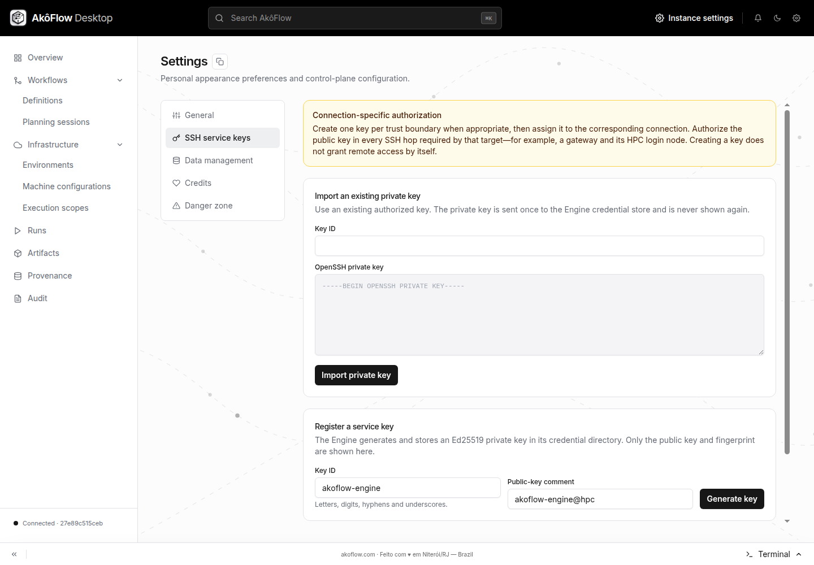
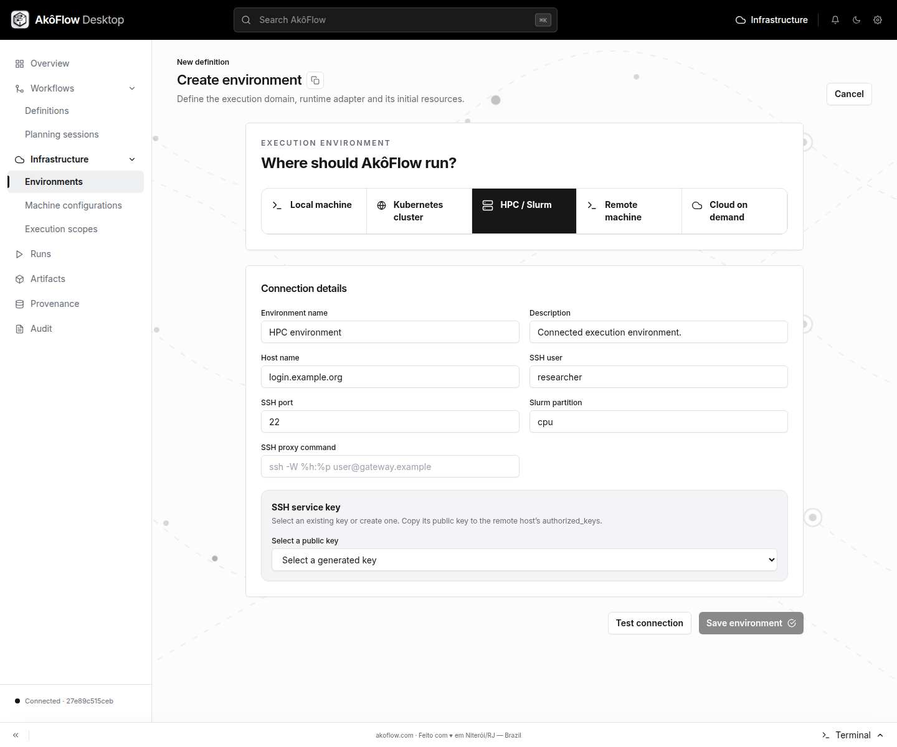

This tutorial registers an existing institutional HPC account in AkôFlow. It
does **not** create an account at the institution or allocate compute time.
Ask the cluster administrator for your login, permitted partition, SSH access
policy, gateway requirements, and a shared workspace before starting.

The result is a saved environment with a healthy connection and reviewed
inventory. Running the first batch job is a separate step after registration.

## Before you begin

- Complete [installation and its result checks](../installation).
- Obtain the login hostname, SSH user and port, SLURM partition, and gateway
  command when required. The AkôFlow daemon must be able to reach that route.
- Obtain authorization to use a managed SSH key and verify the site's host-key
  trust requirements with your administrator.
- Confirm `sinfo`, `sbatch`, `squeue`, `sacct`, and `scancel` are available to your
  account. Review the [HPC operator guide](../guides/infrastructure/hpc-slurm)
  for account/QoS, storage and container-runtime requirements.

`login.example.org`, `researcher`, and `cpu` below are placeholders. Replace them
with the values provided by your institution.

## Through the interface

### 1. Register an SSH service key

Open **Settings → SSH service keys**. Under **Register a service key**, enter
`research-hpc` and choose **Generate key**. Copy the public key and have it
authorized for your account on the login host and required gateways. If the
institution requires an existing key, use the separate import action described
in [Manage SSH service keys](../guides/operations/credentials-and-ssh).



_Choose the gear icon labeled Settings, then the SSH service keys tab. This
capture shows the empty key catalog before generation._

Generating a key in AkôFlow does not grant access to the cluster.

### 2. Fill in the HPC connection

Open **Infrastructure → Environments → Connect environment** and select
**HPC / Slurm**.



_Captured from the official v1.0.8 Linux application through Chromium DevTools,
2026-09-12. Host, user and partition are illustrative values; no remote
connection is claimed._

| Field               | Enter                                                                      |
| ------------------- | -------------------------------------------------------------------------- |
| Environment name    | A recognizable name, such as `Research HPC`                                |
| Host name           | Login hostname only, such as `login.example.org`                           |
| SSH user            | Your institutional login                                                   |
| SSH port            | `22`, unless the administrator specifies another port                      |
| Slurm partition     | The permitted partition name, such as `cpu`                                |
| SSH proxy command   | Leave empty for a direct route, or enter the site-approved gateway command |
| Select a public key | The service key you just authorized                                        |

### 3. Test before saving

Choose **Test connection**. Wait for **Connection verified**; **Save environment**
remains disabled until the test succeeds. If you change a connection field, test
again. A successful SSH session on your laptop is not sufficient: this test
runs from the daemon's host.

Choose **Save environment**, then open the saved environment. In its connection
section, run **Check now** and **Discover**. Review **Inventory** for the
expected cluster partitions and compute nodes; see the detailed
[discovery checks](../guides/infrastructure/hpc-slurm#3-discover-the-actual-cluster-before-trusting-the-catalog).

## Through the API

Complete [API connection setup](./api-access). Use the same approved host,
account and partition as in the graphical path.

### 1. Generate and authorize the key

```bash
curl --fail-with-body \
  -H "Authorization: Bearer $AKOFLOW_API_TOKEN" \
  -H 'Content-Type: application/json' \
  -d '{"id":"research-hpc","comment":"Akoflow research HPC"}' \
  "$AKOFLOW_API_URL/ssh-keys/" -o hpc-key.json

jq '{id, publicKey, fingerprint}' hpc-key.json
```

Authorize the returned `publicKey` through your institution's procedure before
continuing. Keep the returned `credentialRef`; do not invent a private-key path.

### 2. Prepare the environment and test its connection

Download <a href="/examples/onboarding/hpc-environment.template.json" download="hpc-environment.template.json">the HPC environment template</a>
and save it as `hpc-environment.template.json`. This is a complete registration
envelope with an empty inventory; discovery supplies actual cluster resources.

```bash
AKOFLOW_HPC_REF=$(jq -er '.credentialRef' hpc-key.json) || exit 1
jq --arg ref "$AKOFLOW_HPC_REF" \
  --arg host 'login.example.org' \
  --arg user 'researcher' \
  --arg partition 'cpu' \
  '.connections[0].credentialRef=$ref |
   .connections[0].endpoint=$host |
   .connections[0].username=$user |
   .connections[0].configuration.partition=$partition |
   .runtimes[0].configuration.partition=$partition' \
  hpc-environment.template.json > hpc-environment.json
```

Edit `configuration.port` and `configuration.proxyCommand` in the connection
when your site requires them. Read the operator guide for host-key configuration.
Then test the exact connection you intend to save:

```bash
jq '.connections[0]' hpc-environment.json > hpc-connection.json
curl --fail-with-body \
  -H "Authorization: Bearer $AKOFLOW_API_TOKEN" \
  -H 'Content-Type: application/json' \
  --data-binary @hpc-connection.json \
  "$AKOFLOW_API_URL/connection-tests/" -o hpc-test.json
jq . hpc-test.json
jq -e '.healthy == true' hpc-test.json
```

Continue only if the last command succeeds. An HTTP response alone does not
prove the connection is healthy; read its `message` if the test fails.

### 3. Save, inspect health and discover inventory

```bash
curl --fail-with-body \
  -H "Authorization: Bearer $AKOFLOW_API_TOKEN" \
  -H 'Content-Type: application/json' \
  --data-binary @hpc-environment.json \
  "$AKOFLOW_API_URL/environments/" | jq

curl --fail-with-body -X POST \
  -H "Authorization: Bearer $AKOFLOW_API_TOKEN" \
  "$AKOFLOW_API_URL/environment-connections/research-hpc-connection/health/" | jq

curl --fail-with-body -X POST \
  -H "Authorization: Bearer $AKOFLOW_API_TOKEN" \
  "$AKOFLOW_API_URL/environment-connections/research-hpc-connection/discover/" | jq

curl --fail-with-body \
  -H "Authorization: Bearer $AKOFLOW_API_TOKEN" \
  "$AKOFLOW_API_URL/environments/research-hpc/" \
  | jq '{environment: .environment.id, version: .version.id,
         resources: [.resources[] | {id, type, providerId, schedulable}]}'
```

Inspect the health result before running discovery. Keep the environment version
returned by the server when creating an execution scope.

## Verify the registration result

| Evidence          | Expected result                                                      |
| ----------------- | -------------------------------------------------------------------- |
| Saved environment | `research-hpc` appears in the environment catalog                    |
| SSH health        | Healthy from the daemon using the selected credential and route      |
| Discovery         | Expected partitions/nodes appear with plausible capacity             |
| Compute boundary  | The login host is not treated as a batch compute allocation          |
| Shared workspace  | Site-provided path is accessible from an approved compute allocation |

A discovered partition is not a reservation. Registration does not prove that
an account, QoS, container image or shared filesystem will work in a batch job.
Continue with [scope setup and a small real execution](../guides/infrastructure/hpc-slurm#5-scope-validate-and-submit-a-small-real-execution).

## If registration fails

| Symptom                                | Next action                                                                        |
| -------------------------------------- | ---------------------------------------------------------------------------------- |
| No service key in the selector         | Generate/import the key, then reopen the form                                      |
| Connection test fails                  | Read its message; verify host, user, key authorization and gateway from the daemon |
| Saved environment has no partitions    | Run discovery and check `sinfo` availability and connection history                |
| Resources exist but jobs remain queued | Review partition/account/QoS with the administrator                                |

The screenshots and payload structure were checked against the local interface
and handlers. Remote SSH, discovery and a real batch submission require your
institution's access and were not performed for this tutorial's capture.
