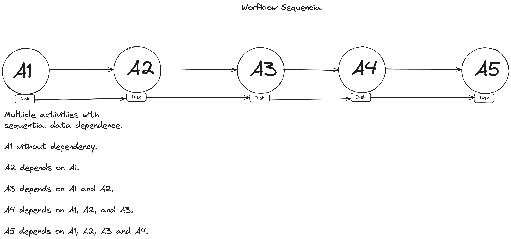

# scik8sflow - Ferramenta para execução de Workflow Científico em Kubernetes

O scik8sflow é uma ferramenta para execução de workflows científicos em Kubernetes. Ele utiliza a API do Kubernetes para criar e gerenciar recursos de execução de workflows, como pods e jobs. O scik8sflow é uma ferramenta de linha de comando que permite a execução de workflows científicos de forma distribuída e paralela em um cluster Kubernetes.

## Guia de Instalação

### GKE (Google Kubernetes Engine)
Para instalar o scik8sflow em um cluster GKE, você irá precisar de um cluster Kubernetes e de permissões de administrador no cluster.

Com isso em mãos, você pode instalar o scik8sflow executando o seguinte comando:

```bash
kubectl apply -f https://raw.githubusercontent.com/ovvesley/scik8sflow/main/pkg/server/resource/scik8sflow-gcloud.yaml

```
Com isso você instalará o servidor do scik8sflow no seu cluster Kubernetes, além do servidor de métricas do Kubernetes [metrics-server](https://github.com/kubernetes-sigs/metrics-server).

Isso é tudo que você precisa para instalar o scik8sflow no seu cluster GKE.

A instalação do SciK8sFlow no GKE é feita através de um arquivo de configuração YAML que contém as definições dos recursos necessários para a execução do SciK8sFlow no cluster. Esse arquivo criará um namespace chamado `scik8sflow`, criará um serviço do tipo `LoadBalancer` para o servidor do SciK8sFlow, criará um deployment para o servidor do SciK8sFlow.

Para consultar o host e a porta do servidor do SciK8sFlow, você pode executar o seguinte comando:

```bash
kubectl get svc -n scik8sflow
```

Retorno esperado:
```bash
NAME                        TYPE           CLUSTER-IP     EXTERNAL-IP   PORT(S)          AGE
scik8sflow-server-service   LoadBalancer   <IP_PRIVADO>   <SEU_HOST>   8080:32191/TCP   5h38m
```

Esse comando irá retornar o host e a porta do servidor do SciK8sFlow. Você pode acessar o servidor do SciK8sFlow com o client do SciK8sFlow neste host e porta. A porta padrão é 8080 e o host é o IP externo do serviço, será disponibilizado pelo provedor de nuvem.


Após essa instalação, você pode instalar o cliente do scik8sflow na sua máquina local. Para isso, você pode baixar o binário do cliente do scik8sflow [aqui]().


Para executar um simples workflow com o scik8sflow, você pode executar o seguinte comando:

```bash
scik8sflow --host <SEU_HOST> --port <SUA_PORTA> --file <CAMINHO_PARA_O_ARQUIVO_YAML.yaml>
```


## Guia de Uso

workflows aceitos pelo scik8sflow são definidos em arquivos YAML. Cada arquivo YAML define um workflow, que é uma sequência de tarefas a serem executadas em um cluster Kubernetes. Cada tarefa é definida por um nome, uma imagem Docker e um comando a ser executado. O scik8sflow executa as tarefas em paralelo, criando um pod para cada tarefa. O scik8sflow também permite a definição de dependências entre tarefas, para que uma tarefa só seja executada após a conclusão de outra tarefa.

Tipos de workflows suportados:

### Workflows Sequenciais

Multiplas atividades são executadas em sequência, uma após a outra, a dependencia de dados entre as atividades é sequencial. É criado apenas um disco persistente para todas as atividades e ele será compartilhado entre todas as atividades, após a conclusão de uma atividade, o disco persistente é montado na próxima atividade.



- Workflows paralelos

(todo)

- Workflow Pegasus

(todo)

### Arquivo de Workflow

O arquivo de workflow é um arquivo YAML que define um workflow. O arquivo de workflow é composto por uma lista de tarefas, onde cada tarefa é definida por um nome, uma imagem Docker e um comando a ser executado. O arquivo de workflow também pode definir dependências entre tarefas, para que uma tarefa só seja executada após a conclusão de outra tarefa.

Para mais informações, acesse o guia de uso [aqui](3-workflow-file).


## Como Funciona

O scik8sflow utiliza a API do Kubernetes para criar e gerenciar recursos de execução de workflows, como pods, jobs, persistent volumes. Ele permite a execução de workflows científicos de forma distribuída e paralela em um cluster Kubernetes.

Para mais informações, acesse o como funciona [aqui](2-how-it-work).