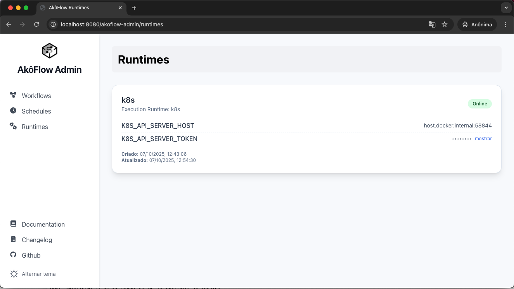

## Software Requirements

- **Operating System:** Linux, macOS, or WSL2 (Windows Subsystem for Linux)
- **Docker:** [Install Docker](https://docs.docker.com/get-docker/)
- **kubectl:** [Install kubectl](https://kubernetes.io/docs/tasks/tools/)
- **Kubernetes Cluster:** One of the following:
   - [Kind](https://kind.sigs.k8s.io/) (local)
   - Docker Desktop Kubernetes (enable Kubernetes in settings)
   - Cloud providers (e.g., EKS, GKE, AKS)

## Quick Installation

Run the following command to install AkôFlow:
```bash
curl -fsSL https://akoflow.com/run | bash
```

AkôFlow will be available at `http://localhost:8080`.

## Setup on Local Kubernetes Cluster (Kind)

1. **Install Kind:**

    Follow the instructions on the [Kind GitHub page](https://kind.sigs.k8s.io/docs/user/quick-start/) to install Kind.

2. **Create a Kind Cluster:**
    ```bash
    kind create cluster --name akoflow-cluster
    ```
    
    **Check Host and Port of the Kubernetes API Server:**
    
    You need to find the host and port of the Kubernetes API server to configure AkôFlow correctly. Run the following command:

    ```bash
    kubectl cluster-info --context kind-akoflow-cluster
    ```
    Look for the line that says `Kubernetes control plane is running at ...`. 

3. **Install AkôFlow in the Cluster:**

    This resource file will set up services, deployments, config maps, and persistent volume claims necessary for AkôFlow to run in a local cluster.

    ```bash
    kubectl apply -f https://raw.githubusercontent.com/UFFeScience/akoflow/main/pkg/server/resource/akoflow-dev-dockerdesktop.yaml
    ```

4. **Create Token for AkôFlow Engine to Access the Cluster:** 
    
    **Note:** The token duration is set to 800 hours. You can adjust it as needed.

    ```bash
    kubectl create token akoflow-server-sa --duration=800h --namespace=akoflow
    ```

5. **Add Variables to `.env` File:**

    AkôFlow will create a `.env` file in the `$HOME/akospace` directory. You need to add the following variables to the `.env` file:

    ```bash
    K8S_API_SERVER_HOST=host.docker.internal:58844
    K8S_API_SERVER_TOKEN=...your_token_here...
    
    AKOFLOW_SERVER_SERVICE_SERVICE_HOST=host.docker.internal
    AKOFLOW_SERVER_SERVICE_SERVICE_PORT=8080
    ```
    Replace `...your_token_here...` with the token you created in the previous step. 
    **Note:** The host can be `localhost` or `host.docker.internal` depending on your Docker setup. The port should match the port of your Kubernetes API server.

6. **Restart AkôFlow:**

   Restart the AkôFlow container and run the installation script again.
   